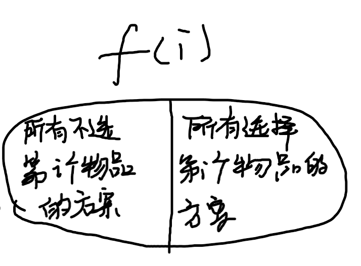
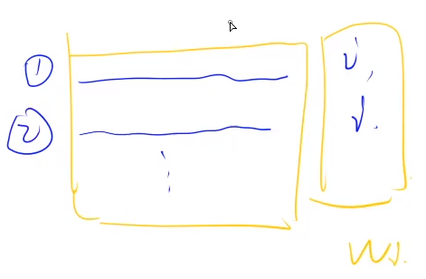

# Chapter5 闫式DP分析法

## 理论讲解

:::caution
分析DP时，要用纸和笔记画出来分析，不要空想，通过画出来找到前后之间的规律。
做算法的时候不是凭空想出来，而是根据之前做过的经验来写。以经验为基础的
从集合的角度去分析DP问题，所有题目都适用。看到问题里面，都是有限集合中的最值，求**最值、数量、存在**。
每种方案都枚举会使得时间复杂度太高，DP为什么可以优化问题？
:::

1. 第一阶段——化0为整
    状态表示：每次处理问题的时候不是一个元素一个元素枚举，而是一类一类，一个子集一个子集那样枚举。
  + 哪个集合，所有满足xxx条件的集合，可以直接表示一整个集合。也就是一个把解看成一个整体，而不是独立来看
  + 集合存什么东西？——属性。(max/min/count/...)
  + 不把问题看的那么复杂，我直接看其中某一个子集，直接看一个解。
2. 第二阶段——化整为0
    状态计算：把f(i)这个集合划分成若干个子集，满足两个原则——不重复，不遗漏。(不重复不一定要满足，求max或min的时候可以不用满足，求count肯定要满足)**为什么？**
  + 若f(i)为求最大值，那么只要把集合里面每个子集的最大值取一个max，求count就是每一个子集的数量相加
    把整体问题划分成子集问题，再处理每一个子集算完后整理
  + 把所有子集求解出来后，再在子集当中求解最优解。因为这些子集已经包含前面的情况，已经是最优了。
  + 集合划分依据：寻找最后一个不同点

## 实例应用

### 0-1背包

闫式DP分析:
有限集合求最值问题。每个物品只有选和不选，从$2^n$的子集里面找到最优的解

- 状态表示: (多做题)选择问题，第$1$维度是表示前$i$个物品，后面的维度都是限制

  1. 集合是什么: 所有只考虑前$i$个物品，总体积不超过j的选法集合
  2. 存的值和集合之间的关系是什么(属性): 集合当中每一个方案的最大价值$\max$。

  所以得到的$f(n,v)$就是表示只考虑前$n$个物品，体积不超过$v$的选法的集合
  最大值就是$f(n,v)$就是答案,也就是所有的$f(i,j)$并起来的子集里面求一个最大，就得到了答案.

- 状态计算：

  1. 

     问题转换成只要求出左边子集的最大值，右边子集的最大值，然后两者取一个最大的就可以求得结果

     + 左边子集求法：根据题目，从$1$到$(i-1)$中选，总体积小于等于$j$的方案的集合，也就是$f(i-1,j)$

     + 右边子集求法：前面随便选，最后必然包含物品$i$，将其分成两个部分，左边是变化的，右边是不变化的。

       

       右边就是$w_i$了，表示所有方案都包含物品$i$，已经不变;因为左边是变化的，所以要让左边最大，变化最大是什么？因为每个方案都是$1$到$i$中选，总体积小于等于$j$，去掉$i$后之后，因为已经包含了，所以就是看$1$到$i-1$这个区间选，因为已经去掉了一个$w_i$，所以总体积小于等于$j-v_i$，那么最大值就是$f(i-1,j-v_i)$描述和状态一一对应，变化最大值加上不变值

     + 最后左右两边的式子求一个$\max$即可得到最值

  > DP的分析和优化是分开的，一般来说都是先完成算法，然后再原来的基础上进行优化

### 背包问题优化

所有

### 完全背包问题

### 石子合并

### 最长公共子序列

### 连续子矩阵和最小

```cpp
#include <iostream>
#include <algorithm>

using namespace std;

const int N = 1e5 + 10;
int f[N], a[N], minnum;


int main() {
    
    int n;
    cin >> n;
    minnum = 0x3f3f3f3f3f;
    
    for (int i = 0; i < n; i++) cin >> a[i];

    f[0] = a[0];    
    for (int i = 1; i < n; i++) {
        f[i] = min(f[i - 1] + a[i], a[i]); // should i included the previous element?
        if (f[i] < minnum) minnum = f[i];
    }
    
    for (int i = 0; i < n; i++) cout << f[i] << " ";
    cout << endl << minnum;
    
    return 0;
}
```

