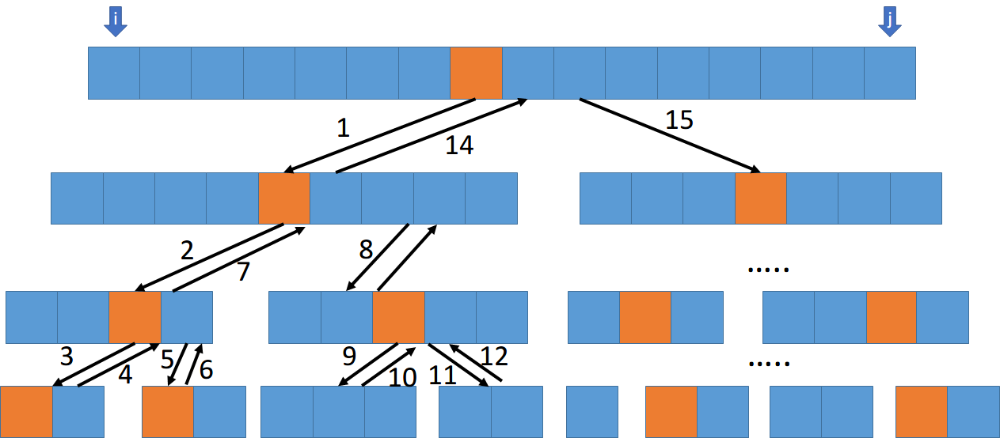
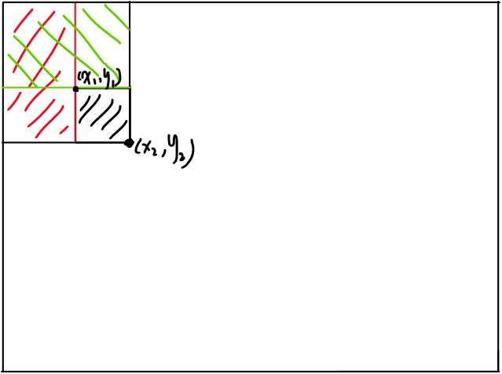
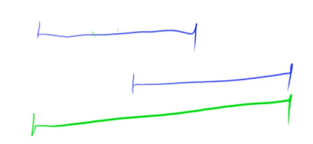

---
tags:
    - BasicAlgorithm
---
# Chapter1 Basic Algorithm

> 刷题小技巧: 如果输入数据量大于 1000000 的话建议使用 scanf 和 printf 进行输入输出
> 
> 任何有规律的重复运算都能被化简
> 
> 模板是为了节省思考的时间
> 
> 本笔记对应代码链接：[https://github.com/PommesPeter/Algorithm-Developement/tree/master/Algorithm-Basic-Tutorial](https://github.com/PommesPeter/Algorithm-Developement/tree/master/Algorithm-Basic-Tutorial)


## 排序
### quicksort (快速排序)
:::caution
一般现场手写的会考
:::
#### 算法流程
1. 确定分界点
   + 直接取左边界
   + 直接取右边界
   + 取中间
   + 随机
2. 调整区间
   + 区间左边的数都小于等于 x，区间右边的数都大于等于 x
3. 递归处理左右两段区间
   + 一次处理左边的区间，然后再处理右边的区间
   + 因为每次调用快排函数都会对其进行排序，也就是调用顺序是一直先排序左边，然后在回溯的时候再排右边

不需要开辟额外空间<使用两个指针来扫数组>

#### 算法特点
:::info
- 注意传参的边界
- x 为选择出来的分界点
- 两个指针 i, j，i 在左边，j 在右边。
- i 的左边的数都是小于 x 的，j 右边的数都是大于 x 的
:::

理解：

1. 从左往右扫描，找到第一个比分界点要大的数；
2. 从右往左扫描找到一个比分界点要小的数；
3. 交换两个数
4. 递归调用，调用顺序是一直先排序左边，然后在回溯的时候再排右边。

调用顺序示意图：



### mergesort (归并排序)

#### 算法流程
1. 先把数组分成多个区间，通过多次递归区间长度的中间
2. 递归到最底部后开始回溯的时候就开始合并数组
3. 合并数组的时候在不同区间各取一个元素进行比较，把小的放先放到临时数组
4. 比较完毕后再把剩下没放完的元素放到临时数组里
5. 最后把临时数组里面的数放回原数组

#### 算法特点
1. 第一次递归是长度 n 的区间，第i次递归的区间则是长度 n/i*2 的区间
2. 每次都是 logn，递归了 n 次，所以复杂度是 nlogn

## 高精度问题
> 一般笔试可能会考
### 存储大整数
- 思路：把数的某一位存到一个数组里
   + 存储的时候第0位存个位比较好
      * 因为做进位的时候在数组末尾补上一个数比较方便
      * 普通数组要在前面添加数，所有元素都要往后移一位，在末尾添加不用移位
### 加法

#### 算法流程
- 核心思路：逐位相加（A[i] + B[i] + t）的时候要把每一位相加的结果的十位和个位分开，个位作为当前的位数，十位作为下一次计算的进位（也就是需要加到 A[i+1] + B[i+1]）(这里不是累加，而是直接保存当前的进位)
> 注意区分 A<=10 和 len(A)<=10，一个指的是数，另一个指的是位数
1. 逐位相加
2. 对于每一位来说，都是由 $A_i+B_i+t$ 组成，t 为进位。（在个位 t = 0,其他看情况）
3. 将 $A_i+B_i+t$ 的结果取出其个位作为当前的位数，也就是压入数组
4. 将 $A_i+B_i+t$ 的结果取出其十位作为下一位运算的进位

```cpp
vector<int> add(vector<int> &A, vector<int> &B) {
	vector<int> res;
    
    int t = 0;
    for (int i = 0; i < A.size() || i < B.size(); i++) {
        if (i < A.size())	t += A[i];
        if (i < B.size())	t += B[i];
        res.push_back(t % 10);
        t /= 10;
    }
    if (t)	res.push_back(1);
    return res;
}
```

### 减法

#### 算法流程
- 核心思路：逐位相减（A[i] - B[i] - t）的时候要判断减得的结果，如果小于0则需要往前面借位，即下一次运算的时候要提前先减1，如果没有产生借位就正常计算。此时当前计算位的值为 $(t+10)%10$，因为 t>=0 时就是t本身，t<0 时那么就是借 10 过来，也就是在原来的基础 +10 即可

1. 逐位相减
2. 比较数的大小确定是否添加符号
3. 对于减法而言，如果相减不够减的时候就要向前面借一位出来
   * 从这里对比加法可以看出，每一位的组成是分两种情况：
      + 如果$A_i-B_i>=0$，则$(A_i-B_i)$
      + 如果$A_i-B_i<0$，则在原来的基础上加上10，则$(A_i-B_i+10)$
   * 对于减法而言，A和B不同的顺序会导致最后计算的值不一样，有两种情况：
      + $A-B>0$，直接减即可
      + $A-B<0$，先计算B-A，再添加负号
   * 总的来说，计算减法主要是把先计算$|A-B|$的值，再根据原来A-B的大小判断是否添加负号
4. 计算完所有位数后处理前导0。

```cpp
bool cmp(vector<int> &A, vector<int> &B) {
    if (A.size() > B.size())	return A.size() > B.size();
    for (int i = A.size() - 1; i >= 0; i --) {
        if (A[i] != B[i])	return A[i] > B[i];
    }
    return true;
}

vector<int> sub(vector<int> &A, vector<int> &B) {
    vector<int> C;
    for (int i = 0; i < A.size(); i++) {
        t = A[i] - t;
        if (i < B.size()) t -= B[i];
        C.push_back((t + 10) % 10);
        if (t < 0)	t = 1;
        else t = 0;
    }
    while (C.size() > 1 && C.back() == 0)	C.pop_back(); // 处理前导0。
    return C;
}
```


### 乘法

#### 算法流程(乘数为1位)
- 核心思路:
  1. 乘数与被乘数的每一位相乘
  1. 确定每一位数的值，与加法类似，其值为 $(A_i \times b)%10$，进位则是  $(A_i \times b)/10$


```cpp
vector<int> mul(vector<int> &A, int b) {
    vector<int> C;
    
    int t = 0;
    for (int i = 0; i < A.size() || t; i++) {
        if (i < A.size()) t += A[i] * b;
        C.push_back(t % 10);
        t /= 10;
    }
    return C;
}
```

### 除法

#### 算法流程

- 核心思路：
  1. 将数划分为 $A_n, A_{n-1}, A_{n-2}, ..., A_1$，从 $A_n$ 开始。
  2. 求 $r_n = A_n\mod b$ 和 $C_n = A_{n} / b$
  3. 计算第二个数，余数先变成$r_{n-1} = r_3 \times 10 + A_{n-1}$，求 $C_{n-1} = r_{n-1}\mod b$
  4. 循环直到计算到低位结束

```cpp
vector<int> div(vector<int> &A, int b, int &r) {
    vector<int> C;
    r = 0;
    for (int i = A.size() - 1; i >= 0;i --) {
        r = r * 10 + A[i];
        C.push_back(r / b);
        r %= b;
    }
    reverse(C.begin(), C.end());
    while (C.size() > 1 && C.back() == 0) C.pop_back();
    
    return C;
}
```

## 二分

> 有单调性一定可以二分，但是二分并不是单调性。

二分的本质：其实是一个边界问题，只要找到某种性质，使得整个区间能够被一分为二，使得区间的一边是满足性质的，另一边是不满足性质的。二分就是寻找这个性质的边界。在数轴上的表现就是边界点。

### 整数二分


- 情况1（查找不满足性质的边界值）
    1. `mid = l + r + 1>> 1`
    2. if (check(mid)) (区间被划分成 \[l, mid\] 和 \[mid + 1, r\] ) (左边为不满足性质的，右边满足性质)
        - true：如果 check 返回 true，说明在**红色**区间找到了 mid，因为我们要找的是不满足性质的边界，若 mid 已经落在了红色的区间，那么相当于已经满足了条件，如果想要进一步缩小区间就要从 [mid, r] 开始找，所以要在 [mid, r] 查答案，更新左边界为 l = mid; 缩小区间。
        - false：如果 check 返回 false，说明在**绿色**区间找到了 mid，因为我们要找的是不满足性质的边界，当前 mid 没有落在不满足性质的区间，所以要进一步缩小范围的话要从 [l, mid - 1] 开始找， 更新右边界为 r = mid - 1。
    
- 情况2（查找满足性质的边界值）
    1. `mid = l + r >> 1`
    2. if (check(mid)) (区间被划分成\[l, mid - 1\]和\[mid, r\]) (左边为不满足性质的，右边满足性质)
       - true： 如果 check 返回 true，说明在**绿色**区间找到了 mid，因为我们要找的是满足性质的边界，若 mid 已经落在了绿色的区间，那么相当于已经满足了条件，如果要进一步缩小区间就要从 [l, m] 寻找边界值，更新左边界为 r = mid ; 缩小区间。
       - false： 如果 check 返回 false，说明在**红色**区间找到了 mid，因为我们要找的是满足性质的边界，当前 mid 没有落在满足性质的区间，所以要进一步缩小区间要从 [mid + 1, r] 开始寻找边界，更新边界为 l = mid + 1;

会产生这两种情况是因为mid落在正确区间的解不一样，二分的方向不一样。       

> - 思考顺序： 确定边界，写好模板，然后根据问题的性质，根据图形（画个数轴）得到二分的边界，性质是什么，再写判断，再用图对比。（check 是 true 的话，答案应该在哪个边界，如果是 false又在哪个边界。）（一定要判断好用什么性质来划分，也就是确定 check 函数的具体定义）
> - 每次都是选择答案所在的那个区间，然后进行下一步处理。每一次二分都保证包含有答案。二分模板一定有解
> - 为什么需要 +1？
>   原因是如果不加上 1，那么mid得到的是下取整的数，那么有可能 [m,r] 更新过后 m 会一直等于 m（m+1==r的情况）会陷入死循环。
> - 二分一定有解，出现无解是因为题目的条件，从题目的条件找到无解的条件。

模板：

```c++
#include <iostream>
using namespace std;
const int N = 1e6 + 10;
int n, m;
int q[N];
int main() {
    cin >> n >> m;
    for (int i =0 ; i < n;i ++) cin >> q[i];
    while (m --) {
        int x;
        cin >> x;
        int l = 0, r = n - 1;
        while (l < r) {
            int mid = l + r >> 1;
            if (q[mid] >= x) r = mid;
            else l = mid + 1;
        }
        if (q[l] != x) cout << "-1 -1" << endl;
        else {
            cout << l << " ";
            int l = 0, r = n - 1;
            while (l < r) {
                int mid = l + r + 1>> 1;
                if (q[mid] <= x) l = mid;
                else r = mid - 1;
            }
            cout << l << endl;
        }
    }
    
    return 0;
}
```

### 浮点数二分

模板:

```c++
#include <iostream>
using namespace std;
int main() {
    double x;
    cin >> x;
    double l = 0, r = x;
    while (r - l > 1e-8) {
        double mid = l + r >> 1;
        if (mid * mid >= x) r = mid;
        else l = mid;
    }
    cout << l << endl;
    return 0;
}
```

## 前缀和与差分

### 前缀和

#### 一维前缀和

前缀和本质上就是一个公式，假设输入一个列表a, 里面元素有$a = [a_1,a_2,...,a_n]$，则前缀和为:$s_i=a_1+a_2+...+a_i$.

前缀和的作用: 能够快速求出原数组中一段数的和，如果给定一个区间的两个端点$l,r$，则这个区间内的数的和为$s_r-s_{l - 1}$，用一次计算就能计算出一段和，原本需要$O(n)$的复杂度。

```cpp
void prefix_sum_1d() {
	int n, m;
    for (int i = 1 ; i <= n; i++) cin >> q[i];
    for (int i = 1; i <= n;i ++) sum[i] = sum[i - 1] + q[i];
	
    while (m --) {
        int l, r;
        cin >> l >> r;
        cout << sum[r] - sum[l - 1];
    }
}
```

#### 二维前缀和

可以快速求出一个子矩阵里面的和。其中表示为$s_{ij}$，表示左上角的子矩阵的和，也就是表示前 $i$ 行和前 $j$ 列的区域内的元素的和。计算公式为:$s_{ij}=s_{i-1j}+s_{ij-1}-s_{i-1j-1}+a_{ij}$

计算边界为$(x_2,y_2)\rarr(x_1,y_1)$的公式为：
$$
s_{x_2,y_2}-(s_{x_2,y_1-1}+s_{x_1-1,y_2}-s_{x_1-1,y_1-1})
$$

- 绿色：$s_{x_1-1,y_2}$
- 红色：$s_{x_2,y_1-1}$
- 交集：$s_{x_1-1,y_1-1}$



```cpp
void prefix_sum_2d() {
    int n, m, q;
    cin >> n >> m >> q;
    
    for (int i = 1 ;i <= n; i++) {
        for (int j = 1 ; j <= m; j++) {
            cin >> a[i][j];
        }
    }
    for (int i = 1; i <= n;i ++) {
        for (int j = 1; j <= m; j++) {
            s[i][j] = s[i - 1][j] + s[i][j - 1] - s[i - 1][j - 1] + a[i][j];
        }
    }
    while (q --) {
        int x1, y1, x2, y2;
        cin >> x1 >> y1 >> x2 >> y2;
        cout << s[x2][y2] - (s[x1 - 1][y2] + s[x2][y1 - 1] - s[x1 - 1][y1 - 1]) << endl;
    }
}
```

### 差分

差分实际上就是求前缀和的逆运算，公式表达为:$a_i=b_1+b_2+...+b_i$。求解差分可以用$b_n=a_n-a_{n-1}(b_1=a_1)$，其中a为前缀和。

差分作用: 对差分数组求前缀和就能得到原数组；**指定某个区间的数全部相加同一个数**，但是不能使用 $O(n)$ 的复杂度，要求使用 $O(1)$ 的复杂度。这样就可以达到优化时间复杂度的效果。

注意：b数组是空想出来的，假设是一个满足这个性质的数组。假想一个数组，a数组是b数组的前缀和，b数组就是差分数组。

```cpp
void insert(int l, int r, int c) {
	b[l] += c;
    b[r + 1] -= c;
}

void differential_ops_1d() {
    int n, m;
    cin >> n >> m;
    for (int i = 1; i <= n; i++) cin >> a[i];
    for (int i = 1; i <= n; i++) insert(i, i, a[i]);
    
    while (m --) {
        int l, r, c;
        cin >> l >> r >> c;
        insert(l, r, c);
    }
    for (int i = 1; i <= n; i++) b[i] += b[i - 1];
    
    for (int i = 1; i <= n; i++) cout << b[i] << endl;
}

void differential_ops_2d() {
    cin >> n >> m >> q;
    for (int i = 1; i <= n;i ++)
        for (int j = 1; j  <= m; j++)
            cin >> a[i][j];
    
    for (int i = 1; i <= n; i++)
        for (int j = 1; j <= m; j++)
            insert2d(i, j, i, j, a[i][j]);
    
    while (q --) {
		int x1, y1, x2, y2;
        cin >> x1 >> y1 >> x2 >> y2 >> c;
        insert(x1, y1, x2, y2, c);
    }
    
    for (int i = 1; i <= n; i++)
        for (int j = 1; j <= m; j++)
            b[i][j] += b[i - 1][j] + b[i][j - 1] - b[i - 1][j - 1];
    for (int i = 1; i <= n; i++) {
        for (int j = 1; j <= m; j++)
            cout << b[i][j] << " ";
        cout << endl;
    }
}
```


## 双指针算法

> 用的比较多

平时常用归并排序、快速排序都是双指针算法。双指针算法主要有两种应用：

- 双指针维护两个数组；

- 双指针维护一个数组。

常规的双重循环暴力遍历复杂度为 $O(n^2)$，双指针算法的目的就是为了优化这种暴力遍历的算法，一般优化到$O(n)$

常规代码结构:

```c++
for (int i = 0, j = 0; i < n; i++) {
    while (j < i && check(i, j)) j++;
    
    // ... 每道题目的代码的具体逻辑
}
```

- 双指针算法的核心思想：常规暴力算法优化时间复杂度。本质上减少一些不必要的指针移动，两个指针之间相互依附。找两个之间的规律
- 双指针算法一般可以从暴力的角度去想，然后对暴力算法进行优化。

## 位运算

### 基础

n的二进制表示中第k位是几？常见题目
- 先把第k位移到最后一位，右移运算 `n >> k`
- 检查个位是几，`x & 1`
- 最后得 `n >> k & 1`

```c++
// 输出一个十进制数的二进制
int main() {
    int n = 10;
    for (int k = 3; k >= 0; k--) cout << (n >> k & 1);
    return 0;
}
// 输出 1010
```
`n >> k & 1` 跟 1 进行与运算取出的是二进制数的个位，因为 1 的二进制只有个位是 1，其他位是 0，当一个数与 1 进行与运算时，其他位就会变成 0，只剩下个位（同理，如果与 1，2，4，8 .... 等数就会得到对应）

### lowbit

表示一个二进制数x的最后一位1。通过这个算法能够找到一个数的二进制中，从左往右数的最后一位1，返回这个数，前导0忽略，1后面的0保留。
```c++
int lowbit(int x ) {
    return x & -x;
}
```

- 当每次都减去最后一位 1 之后，减了多少个 1，就标识二进制数当中有多少个 1。

## 离散化(Integer)

> 注意
>
> - 该离散化是有序的，保序的。 
> - 学会根据数据规模分析自己需要开多大的数组，该题需要开30万的数组是因为插入操作10w，查询操作左右各10w，一共就30w
> - 离散化的本质就是从**大量的数据**当中找到**稀疏分散**的答案。（答案值域大，但答案个数少），操作本质就是映射，将所需要答案映射到一个比较小的区间

离散化主要解决的问题特点是**输入规模可能比较大**，值域比较大 (0-10\^9)，但是个数比较少 (10\^5)，答案的分布比较离散。把这么大规模的数映射到一个从 0 开始的自然数。也就是将一个数组里的数映射到一个从 0 开始的自然数的数组。可能有重复的元素，所以需要去重。

- 数组元素**去重**
  常用写法如下，重点！！！！
```c++
#include <iostream>
using namespace std;
int main() {
    vector<int> v;
    sort(v.begin(), v.end());
    v.erase(unique(v.begin(), v.end()), v.end());
    return 0;
}
```

- unique函数实现原理——双指针算法: 排完序之后：
  1. 他是第一个；
  2. 他和前面一个数不一样，`a[i] != a[i - 1]`。只要满足这两个性质就把这个数拿出来就行

```c++
vector<int>::iterator unique(vector<int> &a) {
    //第一个指针遍历所有的数，第二个指针存储存到了第几个不同的数。j <= i
    int j = 0;
    for (int i = 0; i < a.size(); i++) 
        if (!i || a[i] != a[i - 1]) a[j++] = a[i];
    // a[0] - a[j - 1] 所有a中不重复的数
    return a.begin() + j;
}
```
- 如何计算一个数组 a 离散化之后的结果是多少？
  可以使用二分，找到需要进行离散化的元素，然后进行映射。

## 区间合并

有多个区间，如果彼此之间有交集的话就进行合并，合并成同一个区间，并集作为一个区间。（两个蓝色的区间可以合并成绿色的区间）




> 整体思想: 对左端点把区间进行排序，然后开始扫描，扫描的时候有两个指针 st, ed，扫描的时候从第一个区间开始，判断第一个区间和第二个区间有没有公共点，如果有，就把第一个区间和第二个区间进行合并(合并的时候只需要把下一个区间的右端点赋值给 ed 即可，ed 表示第 i 个区间的右端点)，判断完之后再看下一个区间（**从这里可以看出需要有一个 pair 存区间的左右端点**）。如果不产生任何交集就到此为止了。然后依次往后做。
>
> - 有交集，合并到第一个区间，产生一个新的区间继续寻找交集，找下一个区间。
> - 没有交集，跳过，找下一个区间。

1. 按区间左端点进行排序所有给出的区间

2. 扫整个数组，有两个指针 st, ed；

   （这里会出现三种情况，一种区间 B 在区间 A 的内部，一种是区间 B 与 区间  A 有交集，一种是区间 B 在区间 A 的外面）

   1. 区间 B 在区间 A 的内部
   2. 区间 B 与 区间 A 有交集
   3. 区间 B 在区间 A 的外面

```cpp
#include <iostream>
#include <vector>
#include <algorithm>
using namespace std;

typedef pair<int, int > PII;

const int N = 1e5 + 10;
int n;
int a[N];
vector<PII> segs;

void merge(vector<PII> &segs) {
    vector<PII> res;

    sort(segs.begin(), segs.end()); //按照左端点排序

    int st = -2e9, ed = -2e9;
    for (auto seg : segs) {
        if (ed < seg.first) { // 判断标记区间末尾的位置和下一个区间的位置的位置的关系，如果该条件成立，说明此时区间不用合并，是单独的一个区间
            if (st != -2e9) {
                res.push_back({st, ed});
            }
            st = seg.first, ed = seg.second; // 移动指针位置
        } else { // ed > seg.first 说明区间需要合并，此时末尾的位置就是看哪个区间比较长，取max即可
            ed = max(ed, seg.second); // 延长区间
        }
    }
    if (st != -2e9) res.push_back({st, ed});
    segs = res;
}

int main() {
    cin >> n;
    for (int i =0 ; i <n ; i++ ) {
        int l, r;
        cin >> l >> r;
        segs.push_back({l, r});
    }
    merge(segs);
    cout << segs.size() << endl;

    return 0;
}
```

