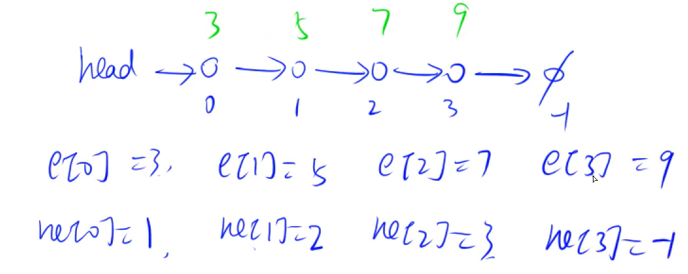
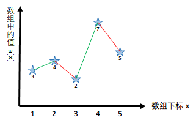
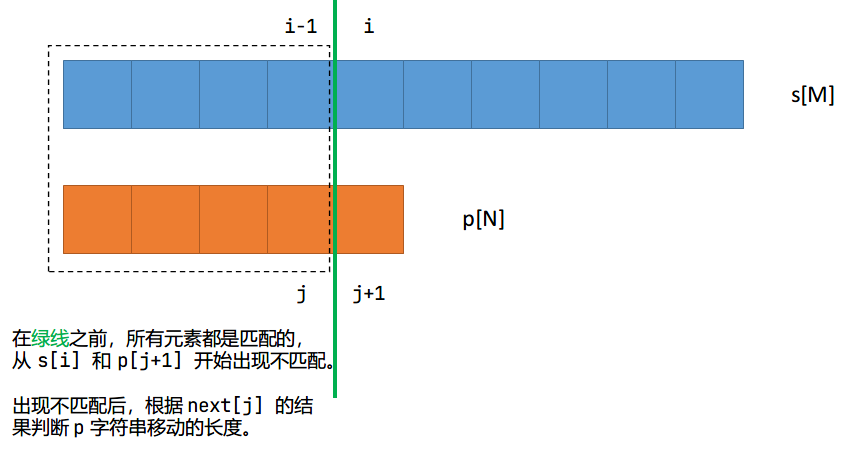

# Chapter2 Data Structure


> Attention：
>
> - 一般在写算法题的时候都是用**数组**来模拟各种数据结构，因为使用结构体每次都要使用 new 创建对象，这个过程非常慢！
> - 算法题一般不用纠结浪费的问题，只需要在特定的时间之内运行完程序就行。
> - 算法题不用纠结空间的问题，目光放在时间上即可。

## Link List

### Single（邻接表）

- 用得比较多的是邻接表，邻接表用于存储**树和图**。

- 用数组表示的方法：

  1. 创建 `e[N]`数组表示链表中节点的值。
  2. 创建`ne[N]`数组表示链表当前节点的下一个，也就是指向下一个节点的指针。

- 对应关系为

  - 用下标来表示，`e[0]`表示链表中 0 号节点的值，`ne[0]`表示链表中 0 号节点的下一个指向的节点的下标。下图可说明。

    

    **其中，当指向的下一个节点为空时用 -1 表示。**

### Dual

>  主要用于优化，具体看题目。双链表就是有两个指针，一个指向前面，另一个指向后面。

- 规定**下标为 0 的点为头节点**，**下标为 1 的点为最后一个点**

- 用数组的表示方法：

  - 创建 `e[N]`数组表示链表中节点的值。

  - 创建 `l[N]` 和 `r[N]` 分别表示链表当前节点的左指针和右指针，分别指向前一个节点的 idx 和 后一个节点的 idx。（l 表示指向左边的，相当于向左的单链表的 `ne[N}`；r 表示指向右边的，相当于向右的单链表的 `ne[N}`。）

    

    


## Stack

- 普通栈

  **先进后出**

```cpp
const int N = 1e6 + 10;
int tt, stk[N];

void insert(int x) { stk[++tt] = x; }
void remove() { tt--; }
int top() { return stk[tt]; }
bool isEmpty() {
    if (tt > 0)
        return 0;
    else
        return 1;
}
```

- 单调栈

   :::tip

   思考思路：

   1. 与双指针类似，先思考暴力做法。

   2. 在暴力基础上思考可以优化地方，思考有哪些性质。

   3. 写算法题基本都是用空间换时间。

   :::

  典型例题：求一个序列当中每一个数的左边离这个数最近的且比它小的数，不存在返回 -1。

  扫描顺序如图（其中，**绿色**为当前数字，**橙色**为判定区域）：

  

  结果为（**黄色和黑色加粗**为当前数字的结果，也就是绿色格子）：

  

  本题中，定义一个栈来存储左边的元素，每扫描一个元素就往栈当中添加当前元素进来。通过观察栈中元素的性质构造一个单调序列， $a_x \ge a_y$ 且 $x < y$，如果 $a_x$ 作为目标值输出，那么 $a_y$ 也可以输出，所以 $a_x$ 就可以被去掉。满足这个性质点都可以被剔除，这些点是没有用的点，可以删除，最终剩下的点就构成一个单调的序列。

  

  上图中，本质上可以看成划分了多个局部的单调序列。只要出现递减的数，就重新构造单调子序列。

  对于 3 而言，没有左边的元素，所以是 -1；

  对于 4 而言，左边比它小的第一个数为 3， 所以是 3；

  对于 2 而言，没有左边比它小的。所以是 -1；（此时扫描到这个数后，相对于前面的序列已经出现递减，故这里是第二个子序列的开始）

  对于 7 而言，左边比它小的第一个数为 2，所以是 2；

  对于 5 而言，左边比它小的第一个数为 2，所以为 2；（此时扫描到这个数后，相对于前面的序列已经出现递减，故这里是第三个子序列的开始）

  所以，综上可以发现，所求的目标值都是每个单调子序列的第一个元素，使用栈进行存储后即为栈顶元素，栈每次都会存储当正在扫描的元素所在的子序列，当遇到递减的元素后就清空栈，重新记录单调子序列。（本质，构成**逆序对**的点可以被删除。）

## Queue

- 普通队列

  **先进先出**

```cpp
const int N = 1e6 + 10;
// 队尾插入元素，队头弹出元素
int hh, tt = -1, q[N];

void insert(int x) { q[++tt] = x; }
void remove() { hh++; }
int front() { return q[hh]; }
int back() { return q[tt]; }
bool isEmpty() {
    if (hh <= tt)
        return 0;
    else
        return 1;
}
```

- 单调队列

  与单调栈类似，典型例题：滑动窗口，输出每次窗口当中的最值。（计算机网络重要应用）
  
  求最小值：当队列（滑动窗口）当中存在一个比最小的数时，其他的数永远都不可能是最小，也就是其他数字永远都不会当成答案输出（性质）。所以其他数字就可以被剔除。（本质，构成**逆序对**的点可以被删除。）构造出一个单调子序列之后，**最小值会在队头出现**。（最大值同理）
  
  

## KMP

:::tip 思考思路

1. 先思考暴力的做法。
2. 如何优化

:::

对于模板字符串的每一个元素都需要模拟出来一个以某点为终点的后缀，得出相等的最大长度是多少。创建一个 `next[N]` 数组，`next[i]` 表示的含义是**以 i 为终点的后缀**和**从 1 开始的前缀**相等，且后缀的长度最长。其中对于 `next[i] = j` 表示 $p[1, j] == p[i - j + 1, i]$。



使用 next 数组进行匹配，一开始判断 $s[i]$ 是否与 $p[j + 1]$ 相等，如果不相等，则需要通过 next 数组移动模板串的位置，修改 j 的值实现$j = ne[j]$。如果相等，则继续往后匹配，直到$j == n$，也就是扫描到模板字符串 p 的末尾说明匹配成功，此时对应起始的点下标就是 $i - n$ ，记得修改 j 的位置，因为匹配成功之后因为已经到达模板串的末尾，通过 next 数组告诉模板串**移动多少距离**可以找到下一个匹配的字符串（j = ne[j]）。

- 求解 next 数组

  

- 匹配字符串

  

## Trie

Trie：高效存储和查找字符串集合的数据结构。以字典形式存储。


## 并查集

## Heap

## Hash Map