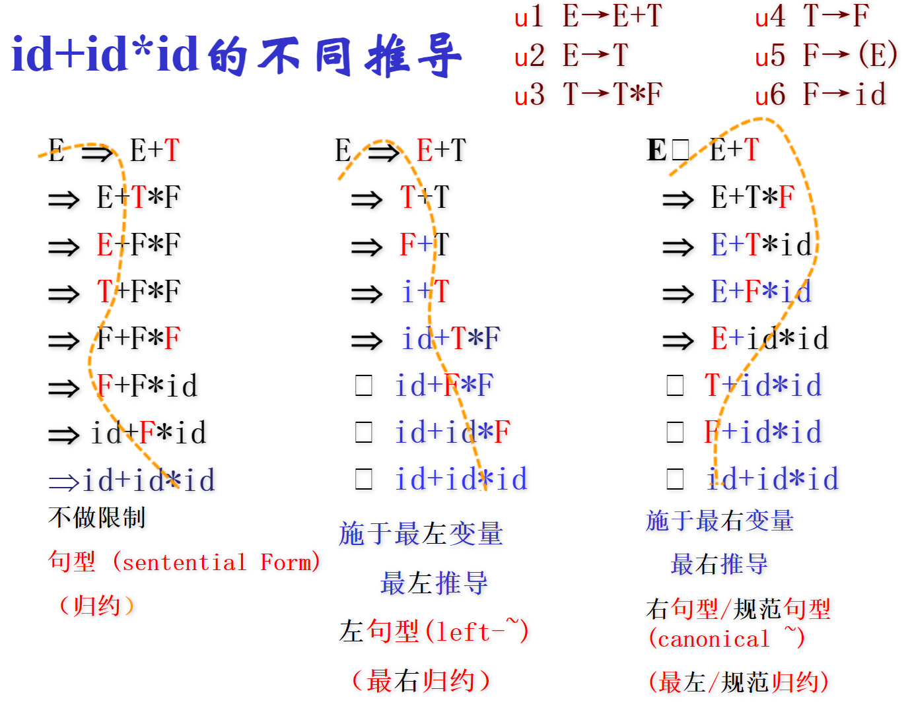
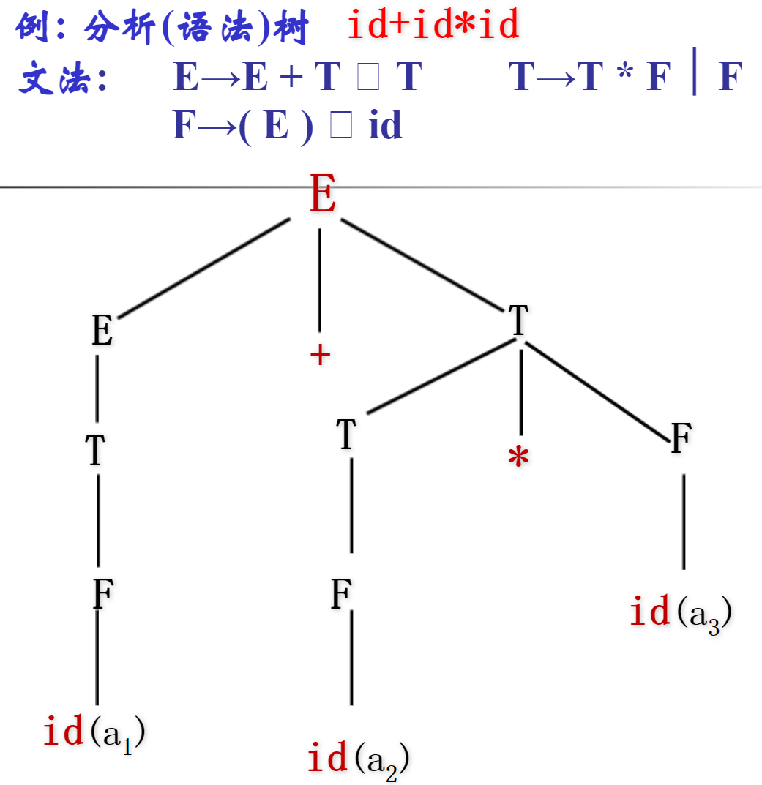

---
tags:
  - Course
  - 编译原理
---

# 语法分析

## 文法

正规式描述能力不够，能够定义一些简单的语言，表示给定结构的固定次数的重复或者灭有指定次数的重复，不能描述成对，配对或者嵌套的串，所以才有文法。

## 句型、句子、语言

单词：满足一定**规则**的字符串。

句子：满足一定**规则**的单词序列。

语言：满足一定**规则**的句子集合。

## 推导和分析树

### 推导

推导是指通过使用给定的文法推导出目标的句子，如下例中的 id * id + id。

推导主要有两种，分别如下：

- 最左推导：优先从左往右进行替换。
- 最右推导（规范推导）：优先从右往左进行替换。

### 分析树

用树的形式表示句子的语法结构。

## 文法的二义性

对于文法来说，有可能会产生二义性，也就是对于一个句型来说，同一个句型能够产生两棵不同的分析树。如下图：

## 句柄、短语

## 自上而下的文法

### 递归文法

消除左递归的方法：

### LL(1)

## 自下而上的文法

### LR(0)

### SLR(1)

### LR(1)

