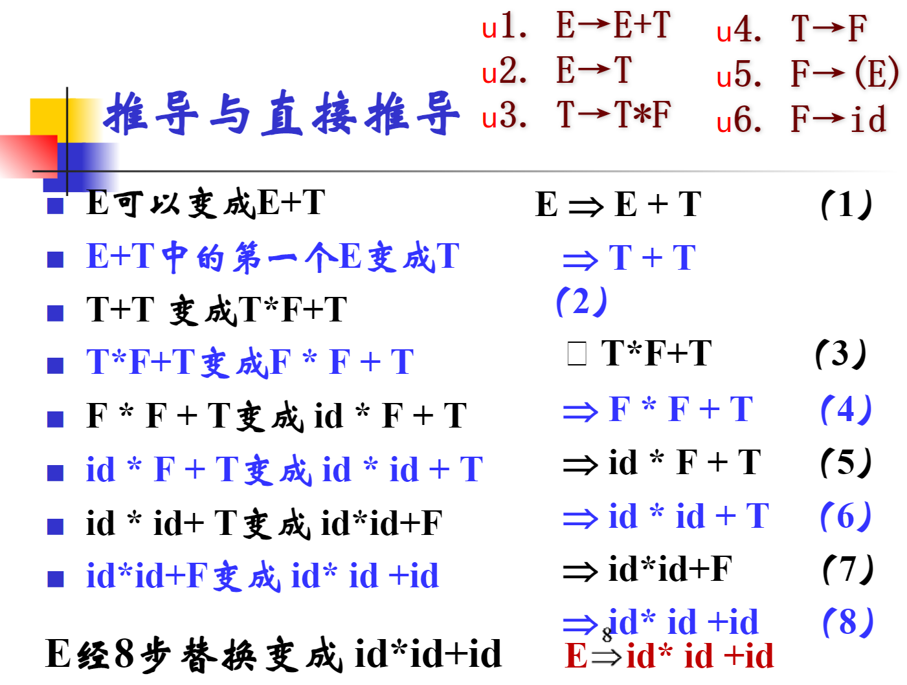
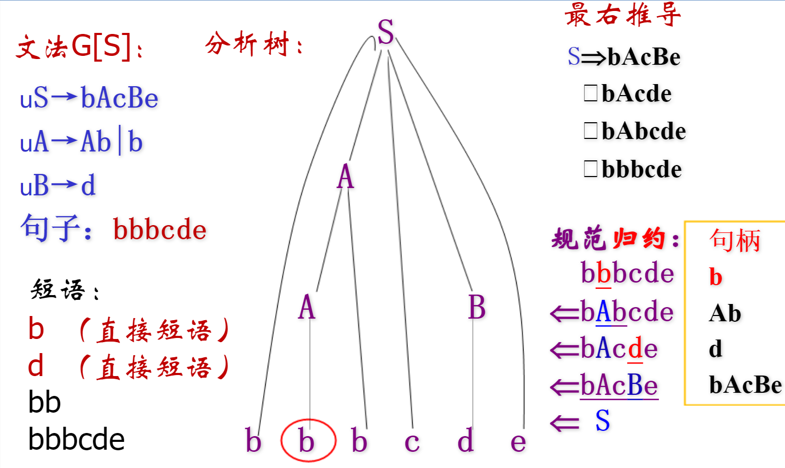
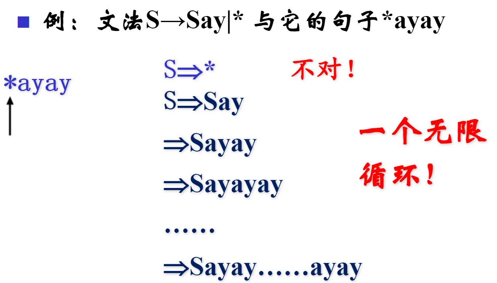
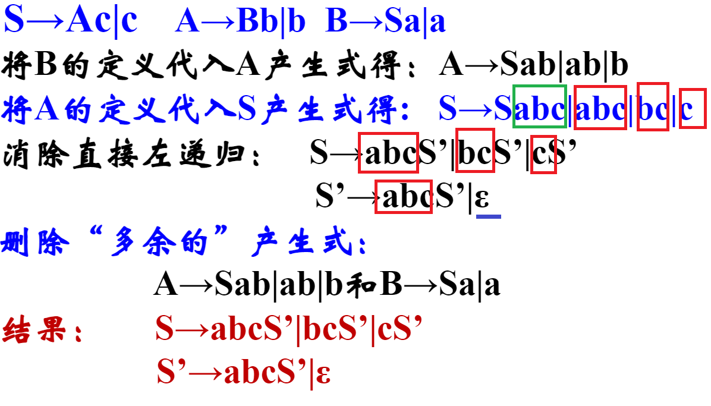
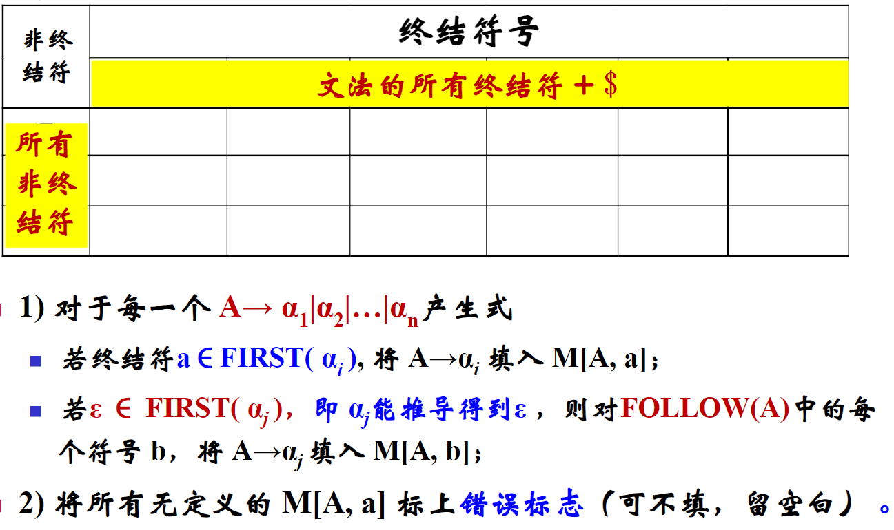
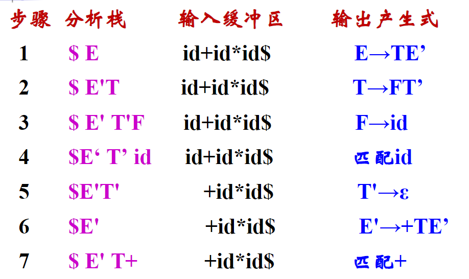
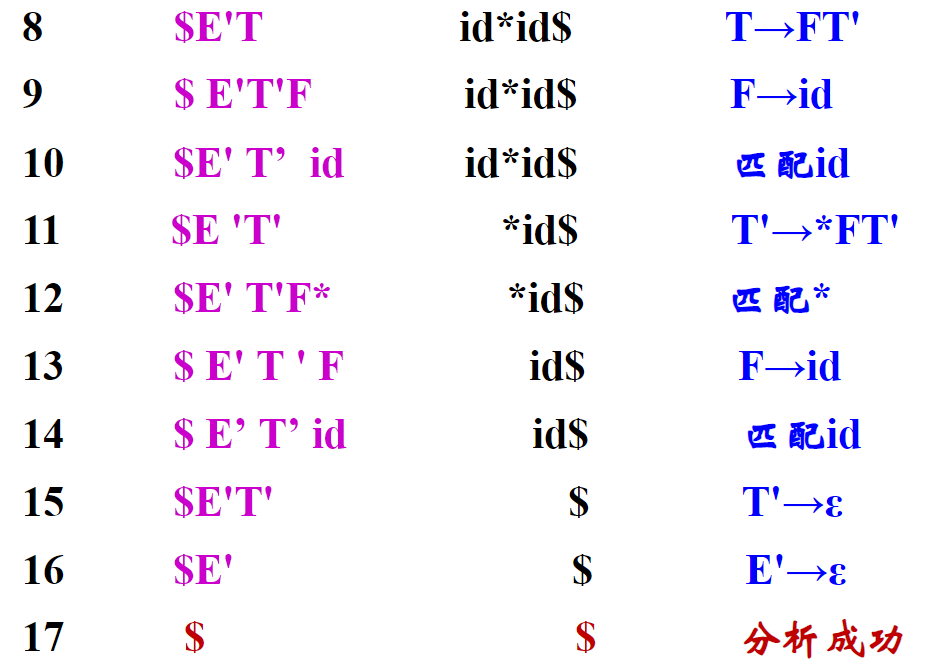
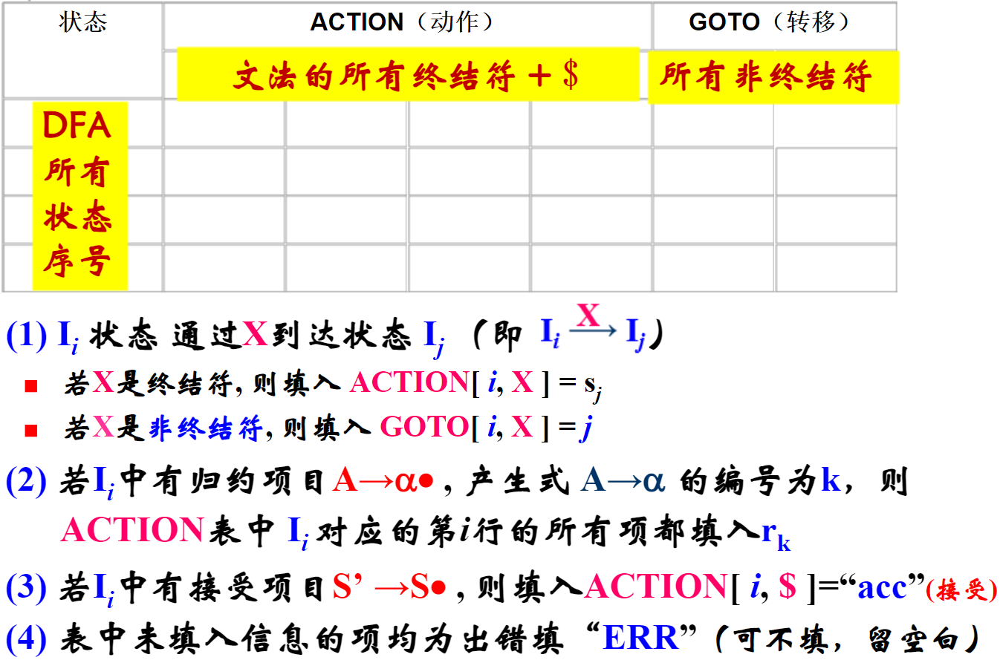
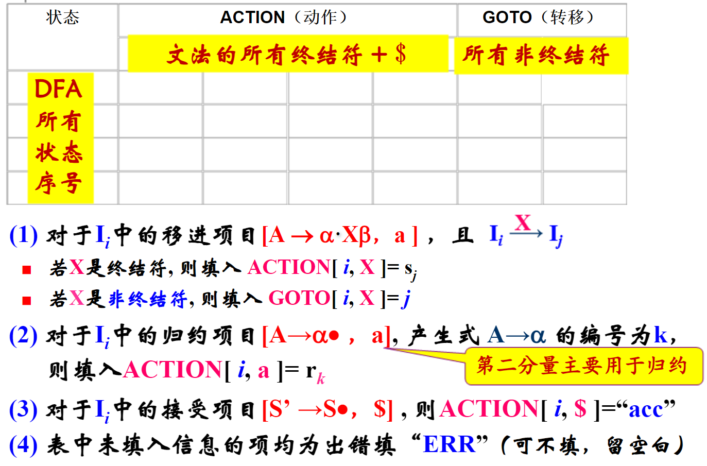

---
tags:
  - Course
  - 编译原理
---

# 语法分析

## 文法

正规式描述能力不够，能够定义一些简单的语言，表示给定结构的固定次数的重复或者灭有指定次数的重复，不能描述成对，配对或者嵌套的串，所以才有文法。

## 句型、句子、语言

单词：满足一定**规则**的字符串。

句子：满足一定**规则**的单词序列。

语言：满足一定**规则**的句子集合。

## 推导和分析树

### 推导

推导是指通过使用给定的文法推导出目标的句子，如下例中的 id * id + id。

推导主要有两种，分别如下：

- 最左推导：优先从左往右进行替换。
- 最右推导（规范推导）：优先从右往左进行替换。

### 分析树

用树的形式表示句子的语法结构。

## 文法的二义性

对于文法来说，有可能会产生二义性，也就是对于一个句型来说，同一个句型能够产生两棵不同的分析树。如下图：

## 句柄、短语

- 句柄：最左直接短语，就是分析树中的叶子。
- 短语：句子里面的其中一个式子。语法树中子树相对于根的短语。也就是一棵子树的叶子。

## 自上而下的文法

### 递归文法

:::caution

消除递归记得补充上空串，在包含有递归的式子后。

:::

消除左递归的方法：

蓝色框：递归重复的部分。

绿色框：递归的入口。

引入一个额外的字母 $E’$，分解成两条式子转换为右递归。将左边对应颜色部分进行对应即可。

消除**间接**左递归：

红色框：递归入口的部分。

绿色框：递归重复的部分。

同样引入额外的字母，将带有方框的蓝色式子的颜色方框一一对应。

### 求解 First 集和 Follow 集

#### First 集 

- 对于首符号为终结符 $V_T$

  对于一个产生式 $\alpha\stackrel{*}{\rarr} abc...$，有：

  First 集为 $\text{First}(\alpha)=\{a\}$，只关注产生式产生的式子的**首个符号**，称为**首符号集**。

  :::tip

  可能会存在 $\alpha\stackrel{*}{\rarr} abc... | def ... | ... | z$ 的情况，则需要把所有的情况考虑，故 First 集为：$\text{First}(\alpha)=\{a,d,...,z\}$

  :::

- 对于首符号为非终结符 $V_N$

  对于一个产生式 $\alpha\rarr ABC...$，有：

  - 若 $A\rarr\epsilon$，则 $\text{First}(A)=\text{First}(A)\cup\{\epsilon\}$，即当首符号为同时要求解 $\text{First}(B)$
  - 否则，$\text{First}(\alpha)=\text{First}(\alpha)\cup (\text{First}(A)-\{\epsilon\})$，这个过程是多次迭代的，直到找到终结符。

#### Follow 集

1. 将 $\$$ 加入到 $\text{Follow}(S)$，其中 $S$ 是文法开始的符号。
2. 若 $A\rarr \alpha B\beta$，则 $\text{Follow}(B)=\text{Follow}(B)\cup(\text{First}(\beta)-\{\epsilon\})$，即求 Follow 集只需要看产生式右侧所求符号的后继，将后继符号的 First 集加入到 Follow 集。
3. 若 $A\rarr \alpha B$ 或 $A\rarr \alpha B\beta,\ \beta\rarr\epsilon$，$\text{Follow}(B)=\text{Follow}(B)\cup\text{Follow}(A)$，即若产生式右侧所求符号的后继为空，则求其产生式左侧符号的 Follow 集。

### LL(1)

1. 消除左递归、左公因子。

2. 求每个候选式的 First 集和所有变量的 Follow 集

3. 检查是否为 LL(1) 文法

   - 任意两个产生式 $A\rarr \alpha|\beta$满足两个条件：
     - $\text{First}(\alpha)\cup \text{First}(\beta)=\varnothing$
     - 如果 $B\rArr\epsilon$，那么则看 $\text{First}(\alpha)\cup \text{Follow}(\beta)=\varnothing$

4. 构造 LL(1) 分析表

   表格式为：

   

   对候选式 $A\rarr a_1|a_2|...|a_n$的右侧求其 First 集，即 $\text{First}(a_1|a_2|...|a_n)$，最后将 First 集中包含的元素按终结符的列填入到 $A$ 对应的行，填入元素为 $A\rarr a_i$。

   如果 $a_j$ 的 First 集中包含空串，则 $\text{Follow}(A)$ 中包含的元素也填入到 $A$ 对应的行，填入元素为 $A\rarr a_j$。

5. 分析句子

   1. 根据所给句子，从开始符出发（分析栈栈顶），从左往右开始，按照句子的符号在分析表中找对应的列，使用对应的语句。
   2. 用产生式右部替换分析栈栈顶（产生式右部的式子从右往左入栈）。
   3. 继续看栈顶查表使用对应的语句。
   4. 直到分析栈为空结束。

   

   

## 自下而上的文法

### 构造活前缀 DFA

### LR(0)

1. 增广文法，添加产生式 $S'\rarr S$。

2. 构造活前缀 DFA。

3. 判断是否为 LR(0) 文法。

4. 构造 LR(0) 分析表。

   

5. 基于分析表分析给定句子。

### SLR(1)

1. 增广文法，添加产生式 $S'\rarr S$。

2. 构造活前缀 DFA。

3. 判断是否为 SLR(1) 文法。

4. 构造 SLR(1) 分析表。（考虑 Follow 集）

   

5. 基于分析表分析给定句子。

### LR(1)

1. 增广文法，添加产生式 $S'\rarr S$。

2. 构造活前缀 DFA。（加入第二分量）

   

3. 判断是否为 LR(1) 文法。

4. 构造 LR(1) 分析表。（考虑第二分量）

5. 基于分析表分析给定句子。
