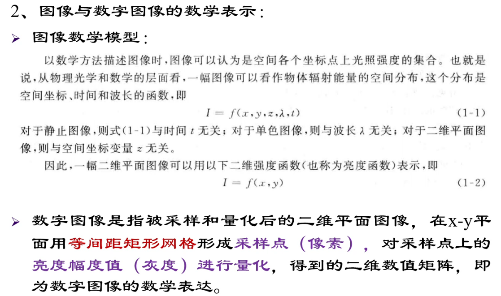
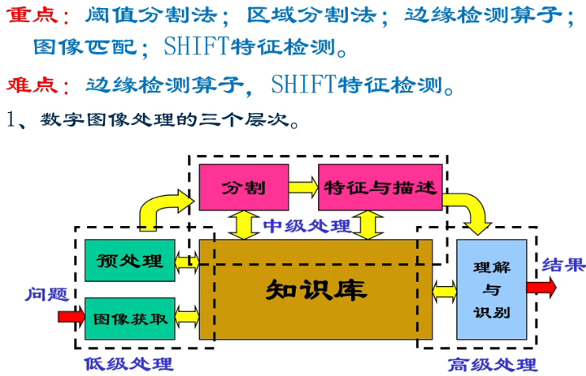
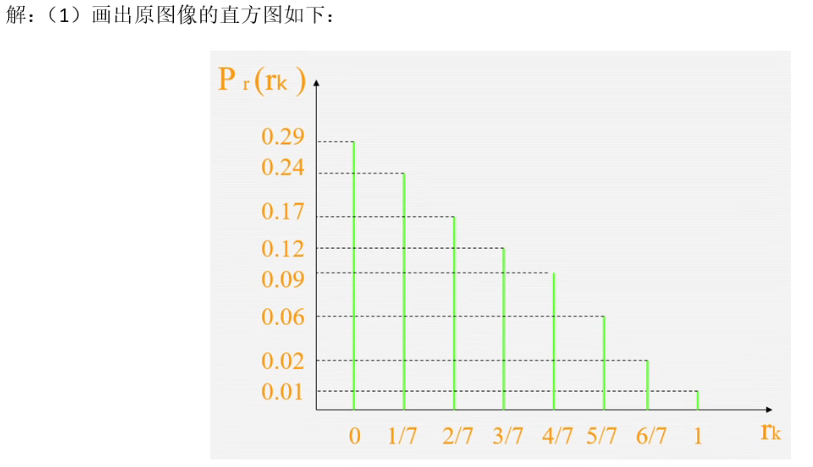

# 习题课

> 考试题型：问答题、分析题、计算题

## 考点

### 第一章 - 基础概念

### 第二章 - 图像数字化

### 第三章 - DIP 数学基础

### 第四章 - DIP 数学运算

### 第五章 - 图像变换

### 第六章 - 图像增强

（必考直方图均衡化、规定化）

### 第七章 - 图像复原

（问答题）

### 第十章 - 图像分割与边缘检测

### 第十一章 - 图像特征与理解

## 习题

### ppt 习题

 

### 计算题

## 规定化

只要看两个累加，然后相互比较，对 R 的累加要从头开始看，如果是 0 就不管，只管不是 0 的映射，找到最接近的两个值，然后把对应的 pr 加起来就得到了pz

