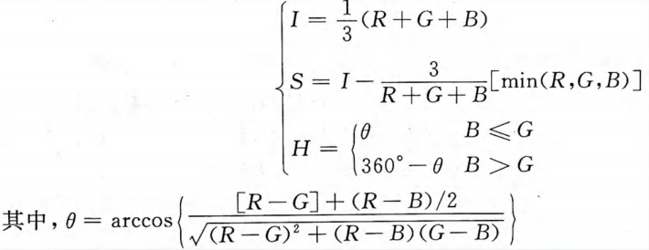
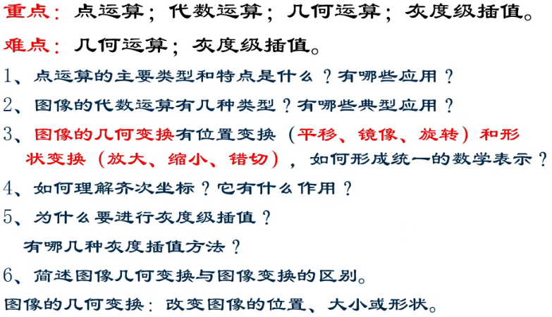
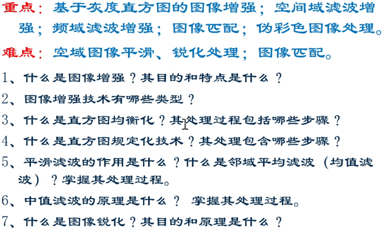
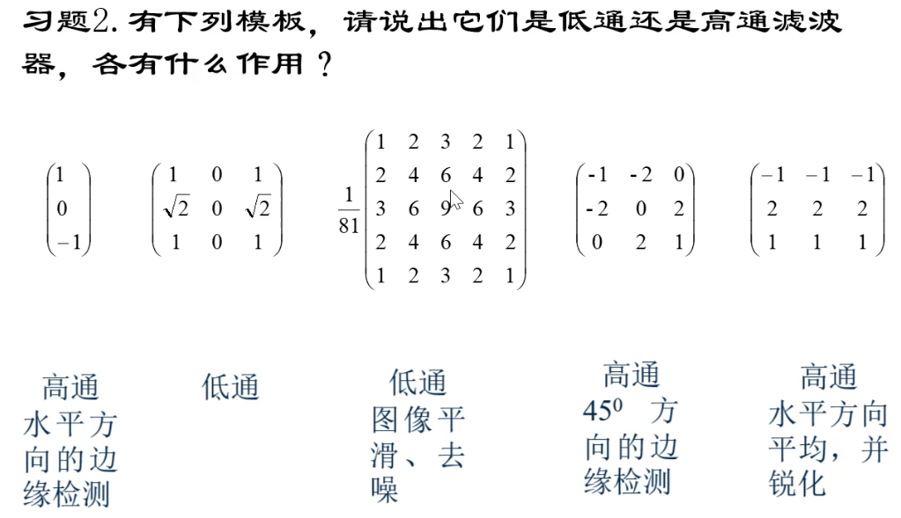
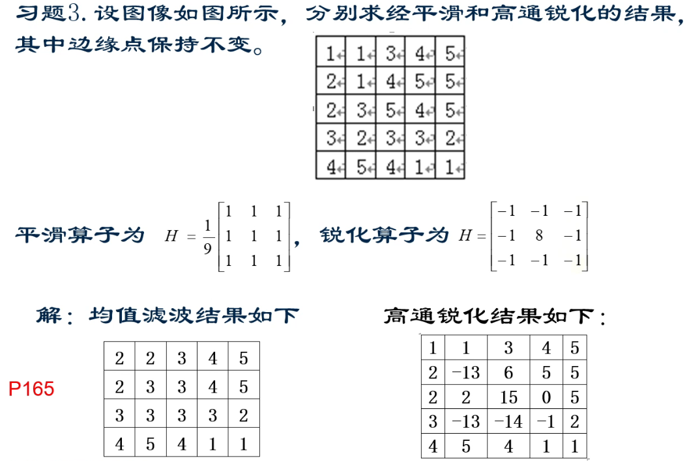
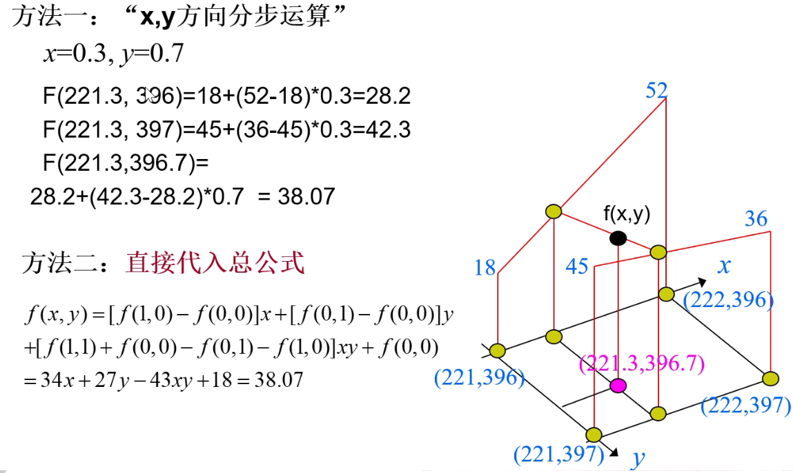
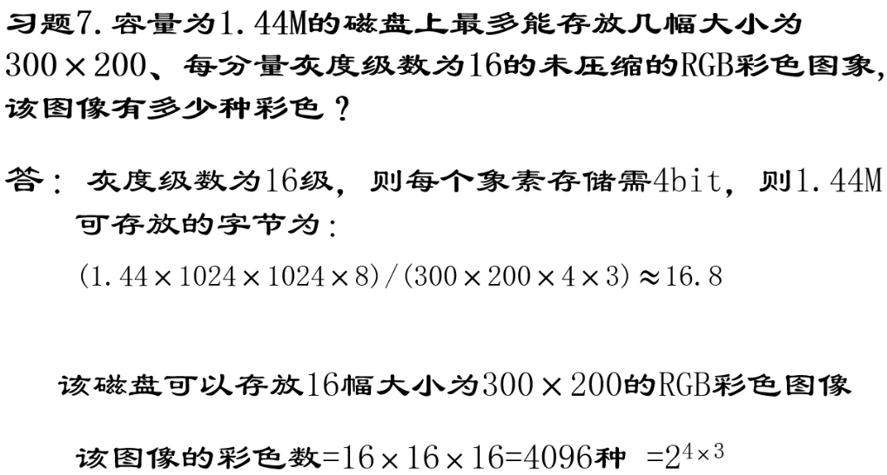
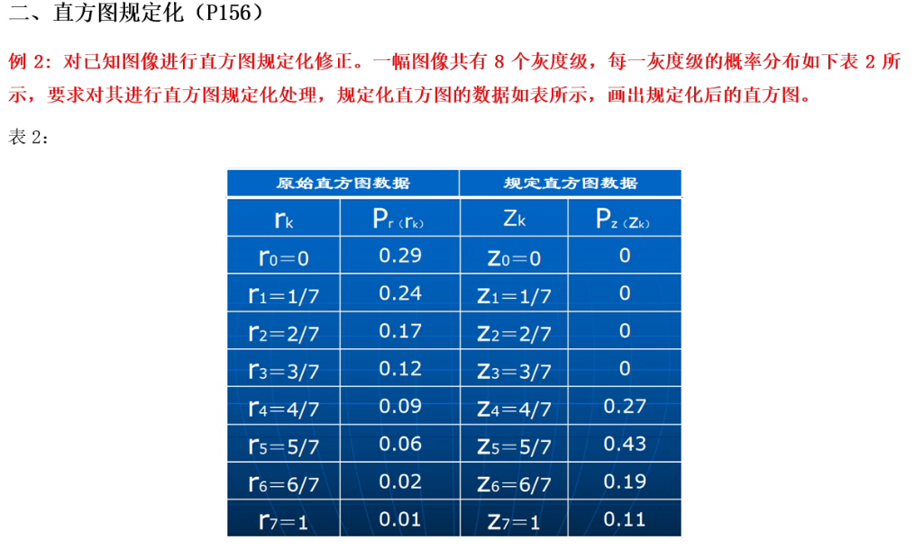
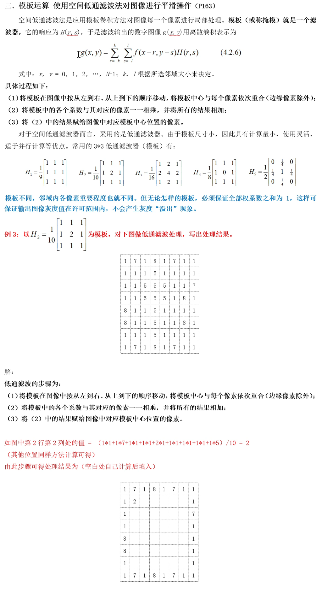

# 习题课

> 考试题型：问答题、分析题、计算题

## 考点

### 第一章 - 基础概念

- 彩色模型：

  - RGB：由红、绿、蓝三色组成
  - HSI：由色度（H）、饱和度（S）、亮度（I）组成
  - CMYK：由青色（C）、品红色（M）、黄色（Y）、黑色（B）组成
  - YUV：由亮度（Y）和两个色差信号（U，V）组成

- RGB 转 HSI 公式：

  

- 图像的存储

  存储图像一个像素占一个字节（`8 bits`），因为表示一个像素需要 8 bits，即 0 ~ 255 范围，故一幅图像有多少个像素（包括不同通道上的）就占用多少个字节。

### 第二章 - 图像数字化

:::tip

看图像的一个像素也要看周围的像素点。四周的或者周围一圈的像素点。

:::

1. 量化：将亮度信息离散化后，用多少位来表示一个像素点。**一般采用 8 bits 量化**。在 3 bits 以下的量化会使得图像出现**伪轮廓的现象**。

   灰度变化**平缓**的地方用较多的量化级，灰度变化**剧烈**的地方使用较高的分别率。

2. 邻域：指图像上的**某一个像素周围邻接的像素**。4-邻域指某一个像素的**上、下、左、右的四个像素**构成的区域。8-邻域指**上下左右相邻的四个像素加上左上、左下、右上、右下四个像素**构成的区域。

   

   邻接：描述两个像素 p 和 q 邻域是否相邻。**4-邻接指 p 像素在 q 像素的4邻域。8-邻接是指 p 像素在 q 像素的8-邻域。对角邻接是指 p 像素在 q 像素的对焦邻域。** m-邻接是指 p 像素在 q 像素的 4 邻域或对角邻域，但 p 和 q 的  4 邻域交集为空。

   连通性：p 和 q 两个像素按照邻接关系存在一条连通的路径，则说明是连通的。（不同的邻接方式组成的区域也不同）

   区域：连通的像素点组成的集合。

   边界：邻域不属于区域的像素点就是边界点，边界点组成的集合成为边界。

   边缘：灰度值产生差异较大的地方。

3. 距离描述方式：

   

   

4. 图片存储格式：

   - BMP：位图文件，包括BMP文件头、位图信息头、颜色表、位图数据

   - GIF：图形交换格式，基于LZW（字串表压缩法）算法的连续色调无损压缩格式。数据压缩比高，占用空间少。可存放若干幅静止图像形成连续的动画，拥有色彩表、支持文本覆盖。可错行存放。

   - JPEG：联合照片专家组，有损压缩去除冗余图像和色彩数据，具有极高的压缩率，采用不同的压缩比来调整图像质量进行压缩。文件大小较小。

     JPE2000：压缩率提高了 30%，支持有损压缩和无损压缩，支持 ROI 感兴趣区域，通过定制区域指定部分区域的压缩。

   - TIFF：标签图像文件格式，图象格式复杂，存储信息多，有利于原稿的复制。支持多种色彩位。可以描述多种类型的图像、拥有一系列压缩方案可选、不依赖于硬件、是一种可移植的文件格式。

   - PNG：可移植网络图形格式，使用 Zlib 无损压缩算法，压缩比高。

5. 技术模板

6. 图像质量评价

   - MSE：均方误差
   - SNR：信噪比
   - PSNR：峰值信噪比
   - SSIM：结构相似度

### 第三章 - DIP 数学基础

### 第四章 - DIP 数学运算

### 第五章 - 图像变换

### 第六章 - 图像增强

（必考直方图均衡化、规定化）

### 第七章 - 图像复原

（问答题）

### 第十章 - 图像分割与边缘检测

### 第十一章 - 图像特征与理解

## 习题

### ppt 习题

 

### 计算题

## 规定化

只要看两个累加，然后相互比较，对 R 的累加要从头开始看，如果是 0 就不管，只管不是 0 的映射，找到最接近的两个值，然后把对应的 pr 加起来就得到了pz

