# 习题课

> 考试题型：问答题、分析题、计算题

## 考点

### 第一章 - 基础概念

- 彩色模型：

  - RGB：由红、绿、蓝三色组成
  - HSI：由色度（H）、饱和度（S）、亮度（I）组成
  - CMYK：由青色（C）、品红色（M）、黄色（Y）、黑色（B）组成
  - YUV：由亮度（Y）和两个色差信号（U，V）组成

- RGB 转 HSI 公式：

  

- 图像的存储

  存储图像一个像素占一个字节（`8 bits`），因为表示一个像素需要 8 bits，即 0 ~ 255 范围，故一幅图像有多少个像素（包括不同通道上的）就占用多少个字节。

### 第二章 - 图像数字化

:::tip

看图像的一个像素也要看周围的像素点。四周的或者周围一圈的像素点。

:::

1. 量化：将亮度信息离散化后，用多少位来表示一个像素点。**一般采用 8 bits 量化**。在 3 bits 以下的量化会使得图像出现**伪轮廓的现象**。

   灰度变化**平缓**的地方用较多的量化级，灰度变化**剧烈**的地方使用较高的分别率。

2. 邻域：指图像上的**某一个像素周围邻接的像素**。4-邻域指某一个像素的**上、下、左、右的四个像素**构成的区域。8-邻域指**上下左右相邻的四个像素加上左上、左下、右上、右下四个像素**构成的区域。

   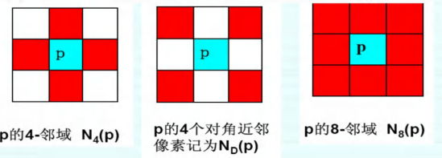

   邻接：描述两个像素 p 和 q 邻域是否相邻。**4-邻接指 p 像素在 q 像素的4邻域。8-邻接是指 p 像素在 q 像素的8-邻域。对角邻接是指 p 像素在 q 像素的对角邻域。** m-邻接是指 p 像素在 q 像素的 4 邻域，或 p 像素在 q 像素的对角邻域但 p 和 q 的 4 邻域的相交的交集为空。

   连通性：p 和 q 两个像素按照邻接关系存在一条连通的路径，则说明是连通的。（不同的邻接方式组成的区域也不同）

   区域：连通的像素点组成的集合。

   边界：邻域不属于区域的像素点就是边界点，边界点组成的集合称为边界。

   边缘：灰度值产生差异较大的地方。

3. 距离描述方式：

   

   

4. 图片存储格式：

   - BMP：位图文件，包括BMP文件头、位图信息头、颜色表、位图数据

   - GIF：图形交换格式，基于LZW（字串表压缩法）算法的连续色调无损压缩格式。数据压缩比高，占用空间少。可存放若干幅静止图像形成连续的动画，拥有色彩表、支持文本覆盖。可错行存放。

   - JPEG：联合照片专家组，有损压缩去除冗余图像和色彩数据，具有极高的压缩率，采用不同的压缩比来调整图像质量进行压缩。文件大小较小。

     JPE2000：压缩率提高了 30%，支持有损压缩和无损压缩，支持 ROI 感兴趣区域，通过定制区域指定部分区域的压缩。

   - TIFF：标签图像文件格式，图象格式复杂，存储信息多，有利于原稿的复制。支持多种色彩位。可以描述多种类型的图像、拥有一系列压缩方案可选、不依赖于硬件、是一种可移植的文件格式。

   - PNG：可移植网络图形格式，使用 Zlib 无损压缩算法，压缩比高。

5. 技术模板

6. 图像质量评价

   - MSE：均方误差，比较两个图片逐像素之间的距离，再求其平均值。
     $$
     \text{MSE}=\frac{1}{MN}\sum\sum(f_{ij}-f'_{ij})^2
     $$
   
   - SNR：信噪比，参考图像素值的平方均值与均方误差的比值的对数值的10倍。
     $$
     \text{SNR}=10\lg\frac{\frac{1}{MN}\sum_{x,y}f^2(x,y)}{\frac{1}{MN}\sum_{x,y}v^2(x,y)}
     $$
   
   - PSNR：峰值信噪比，最大信号量与噪声强度的比值。**用图像的最大像素值代替最大信号量。**
     $$
     \text{PSNR}=10\lg\frac{255^2}{\frac{1}{MN}\sum_{x,y}v^2(x,y)}=10\lg\frac{255^2}{MSE}
     $$
   
   - SSIM：结构相似度，考虑图像的亮度相似度、对比度相似度、方差相似度的度量值的指标，衡量图像质量。
     $$
     \text{SSIM}(x,y)=[l(x,y)]^\alpha[c(x,y)]^\beta[s(x,y)]^\gamma \\
     l(x,y)=\frac{2\mu_x\mu_y+c_1}{\mu_x^2+\mu_y^2+c_1} \\
     c(x,y)=\frac{2\sigma_x\sigma_y+c_2}{\sigma_x^2+\sigma_y^2+c_2} \\
     s(x,y)=\frac{\sigma_{xy}+c_3}{\sigma_x\sigma_y+c_3}
     $$
   
     **SSIM 越大，说明图像质量越好，SSIM 越小，说明图像质量越差。**其中：
     $$
     \mu_x=\frac{1}{N}\sum_{i=1}^Nx_i,\ \sigma_x=\sqrt{\frac{1}{N-1}\sum_{i=1}^N(x_i-\mu_x)^2} \\
     \mu_x=\frac{1}{N}\sum_{i=1}^Ny_i,\ \sigma_y=\sqrt{\frac{1}{N-1}\sum_{i=1}^N(y_i-\mu_y)^2} \\
     \sigma_{xy}=\frac{1}{N-1}\sum_{i=1}^N(x_i-\mu_x)(y_i-\mu_y)
     $$
     分别表示为图像的**均值、标准差和协方差。**

### 第三章 - DIP 数学基础

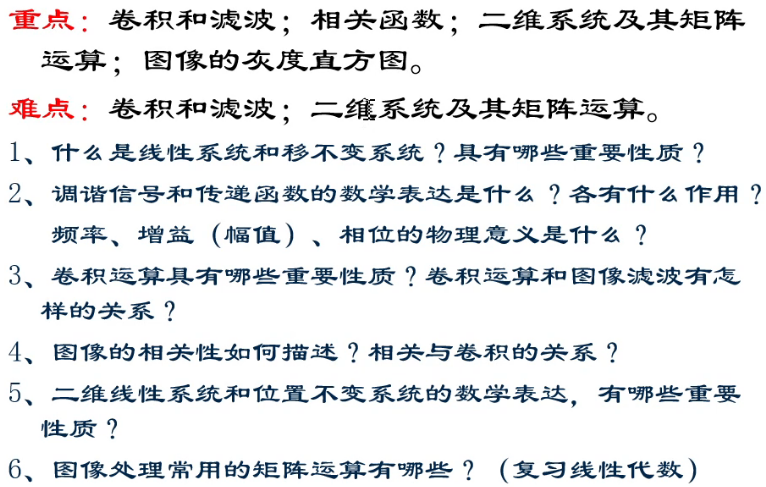

1. 线性系统是指可以接受一个输入并且产生一个输出的实体，且这个系统是线性的。系统的定义为 $y_i(t)=f[u_i(t)]$

   如果满足 $y_1(t)+y_2(t)=f[a_1u_1(t)+a_2u_2(t)]=a_1f[u_1(t)]+a_2f[u_2(t)]$，则系统满足线性。

   移不变系统，当一个系统的平移了相同长度的 $T$，但是输入对应的输出也是一样的。输入任意时刻的事件，输出也延时同样的时刻 $T$，但幅值保持不变，表示为 $f[u(t-T)]=y(t-T)$。**也就是该系统产生的信息号和发生的时刻无关，只和对应的系统有关。**

2. 调谐信号：$x(t)=e^{j\omega t}=\cos(\omega t)+j\sin(\omega t)$

   系统响应为 $y(t)=K(\omega, t)x(t)$，复值函数 $K(\omega, t)$：$K(\omega,t)=\frac{y(t)}{e^{j\omega t}}$

   可以证明，线性移不变系统对于**调谐信号的响应等于输入信号乘以传递函数**。传递函数包含了所表示的**系统的所有特征。**

   线性移不变系统性质：

   - 调谐输入总产生**同频率**的调谐输出。
   - 系统的传递函数——一个依赖于频率的复值函数，包含了**系统的全部信息**。
   - 传递函数对调谐信号的输入会产生两种影响——**幅度变化和相位的平移**。

   **幅值表示系统对输入信号的放大或者衰减倍数，相位表示位移角，将输入信号以时间原点进行平移。**

3. 卷积运算的性质：满足交换律、结合律、分配律、求导。

   卷积运算在信号、图像处理学科上称为**滤波**。线性移不变系统的输出可以用**卷积**来描述，使用**输入信号和冲击响应函数的卷积**表示 $y(t)=u(t)*h(t)$，**冲击相应函数也描述了整个系统的特征**。（所以在卷积神经网络中，权重表示了图像的特征）

4. 图像相关性：$R_{fh}(t)=f(t)\circ h(t)=\int_{-\infin}^\infin f(\tau)h(t+\tau)d\tau$。经过化简之后可得本质上是一个信号反折之后的卷积，即 $R_{fh}(t)=f(t)\circ h(t)=f(-t)*h(t)$。

5. 二维线性系统：$g_i(x,y)=T[f_i(x,y)]$，满足$a_1g_1(x,y)+a_2g_2(x,y)=T[a_1f_1(x,y)+a_2f_2(x,y)]=a_1T[f_1(x,y)]+a_2T[f_2(x,y)]$，则是线性的系统。

   二维线性移不变系统（位置不变线性系统）：满足 $g(x-x_0,y-y_0)=T[f(x-x_0,y-y_0)]$

6. 矩阵运算：转置、求逆、共轭等

7. 梯度：二维图像两个方向的导数，故为向量。

   二维梯度算子，所有的算子都是以**差分**的形式表示。
   $$
   \begin{cases}
   \Delta_xf=f(m,n)-f(m-1,n) \\
   \Delta_yf=f(m,n)-f(m,n-1)
   \end{cases}
   $$
   幅值和方向为：
   $$
   \nabla f=\sqrt{(\Delta_xf)^2+(\Delta_yf)^2} \\
   \theta=\arctan(\Delta_yf/\Delta_xf)
   $$
   对于离散系统，可以简化为：
   $$
   \nabla f \approx |\Delta_xf| + |\Delta_yf| \\
   \nabla f \approx max(|\Delta_xf|, |\Delta_yf|)
   $$

8. 灰度直方图

   灰度直方图是对灰度图像中不同像素值的像素进行统计。

   直方图的性质

   - 直方图不包含位置信息
   - 图像与直方图之间是一种多对一的关系
   - 直方图可叠加

9. 统计特征：信息量、均值、方差、众数、中值、值域、协方差。

### 第四章 - DIP 数学运算

1. 运算：

   - 点运算：针对图像的像素值进行逐个运算。

     

     

     

   - 代数运算：两幅输入图像之间进行点对点的加减乘除运算。

   - 几何运算：对图像进行平移、旋转、放大、缩小等变换，以及变换中灰度内插处理。

2. 代数运算：两幅输入图像之间进行点对点的加减乘除运算。

   加：降噪效果、生成图像叠加效果

   减：消除背景、检测同一场景两幅图像之间的变化

   乘：图像的局部显示

   除：医学图像处理、遥感图像处理

3. 几何运算：对图像进行平移、旋转、放大、缩小等变换，以及变换中灰度内插处理。

   空间变换：齐次变换、平移变换、镜像变换、旋转变换、

   灰度插值：最近邻插值、双线性插值、三阶插值

4. 齐次坐标：使得图像能够用统一的线性变换实现几何变换，需要一种统一的坐标，将图像统一化表示后再进行操作。有了齐次坐标就能够方便做任何形式的变换。

5. 部分比几何变换的方法需要生成原本不存在的像素值，如比例缩放、旋转变换。所以需要使用**插值**的方式来补充图像上缺少的像素。插值方法根据其附近的像素使用算法计算出在某个位置的像素值。

   常见的三种内插方法：最近邻插值、双线性插值、三阶插值

6. 图像变换：通过数学映射的方式，将空域图像转换到频域、时域等方式进行分析。

   几何变换：改变图像的大小和形状。

### 第五章 - 图像变换

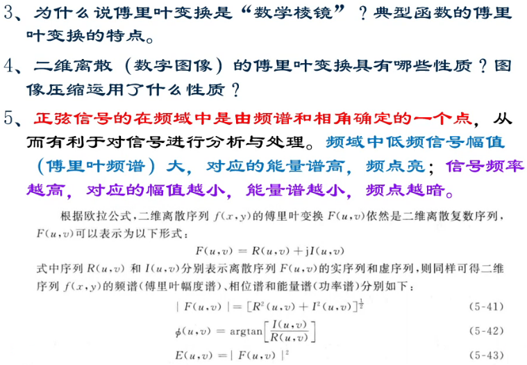

1. 图像变换方法加快对图像的处理速度，对图像进行等价的替换。

2. 常用图像变换方法：

   - 离散傅立叶变换(DFT)
   - 离散余弦变换(DCT)
   - 离散K-L变换(DK-LT)
   - 离散沃尔什变换(DWT)
   - 离散哈达玛变换(DHT)
   - 小波变换(Wavelet Transforms)

3. 一幅图像经过傅里叶变换就把源图像中的信号给分开了，这样做各种处理就更方便。像棱镜把单色光分成不同频率的光一样。

4. 二维离散傅立叶变换性质：

   - 可分离性：二维傅立叶变换是对图像进行两次傅立叶变换。
   - 周期性
   - 共轭对称性
   - 旋转不变性
   - 可微分
   - 平均值性质
   - 卷积性质：在频域的乘积等价于在时域进行卷积
   - 互相关、自相关：时域上的互相关操作等价于频域上的乘积。

   图像数据压缩：利用频谱图对中心点是共轭对称的，只要传输一部分，通过对称性复原另一部分即复原图像。

5. 高频能量谱低，频点暗；低频能量谱高，频点亮。

### 第六章 - 图像增强

1. 图像增强是为了通过算法突出有用的信息，抑制不需要的信息。图像增强不会增加原始图像的信息。

2. 见图：

   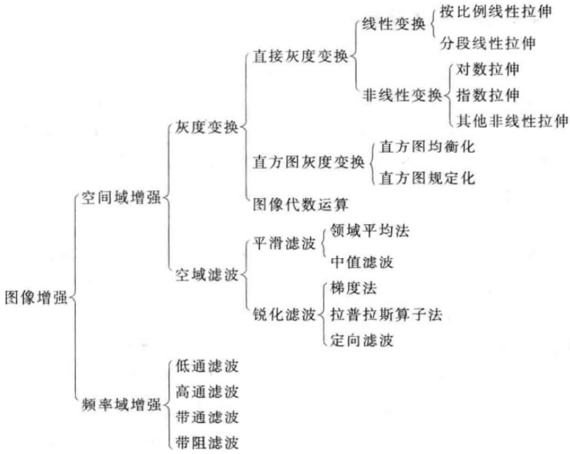

3. 直方图均衡化：从图像的直方图出发，使得图像的灰度级概率密度分布变得均匀，使得图像看起来清晰。

   

4. 直方图规定化：修改图像的直方图，使其与规定要求的直方图一致。

5. 平滑滤波**对低频分量增强，抑制高频分量，消除随机噪声**，起到图像平滑的作用。

   均值滤波：使用一个卷积核扫描图像，计算卷积核扫描到的像素点的**均值**，填入新像素值。（适合去除高斯噪声

6. 中值滤波：与均值同理，求均值换成求中值。（适合去除椒盐噪声）

7. 图像锐化为了增强图像**边缘轮廓**，消除或减弱低频信息，突出图像的**边缘纹理**信息。基于对图像的微分或差分运算。

:::caution

必考直方图均衡化、规定化

:::

8. 梯度法、Laplace 算子法、定向滤波。

   梯度法：罗伯特算子是一阶微分算法

   Laplace 算子：二阶微分算法。

   定向滤波：对特定方向的物体行迹的增强方法。

   

9. 待

10. 频率滤波：将图像变换到频域后进行增强处理。使用傅立叶变换将图像变换到频域，增强后再使用傅立叶逆变换恢复。截止频率是指在低通滤波器中滤波器能通过的最大频率，大于这个频率的无法通过。、

11. 各种滤波器：

    低通滤波器：增强低频信息，抑制高频，图像平滑

    高通滤波器：增强高频信息，抑制低频，图像锐化

    带通、带阻滤波器：增强选定的频率信息

    决定增强效果关键在于如何选择一个合适的传递函数来处理，传递函数就是特征。

12. 暂无

13. 彩色增强方法：伪彩色增强

    由少信息量获得多信息量必然是**基于估计原理**，即对未知的部分，通过各种手段进行合理的估计。

    - 密度切割

      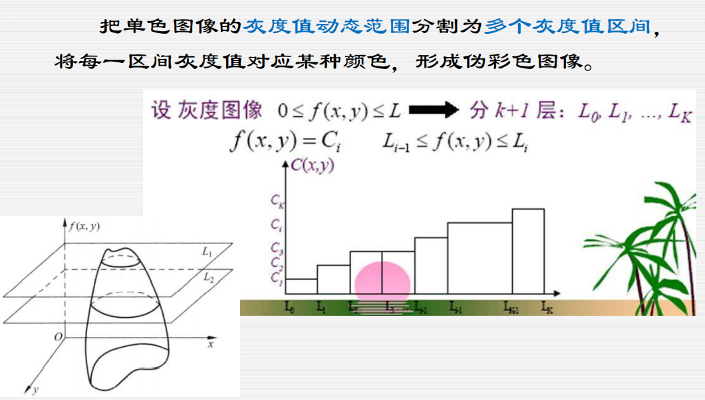

    - 灰度级伪彩色变换

      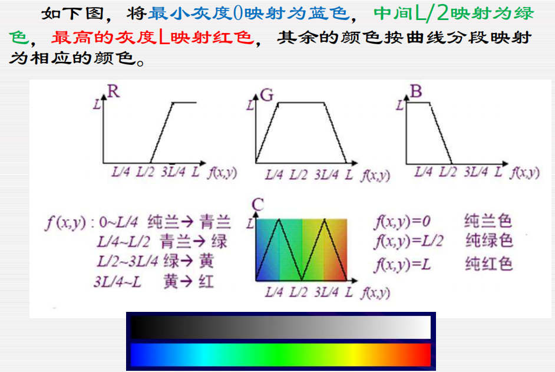

    - 频域滤波

      

14. 真彩色图像是能真实反映自然物体本来颜色的图像；伪彩色是指分配彩色给某一灰度范围或某一灰度值，以增强图像辨识能力。

### 第七章 - 图像复原

（问答题）

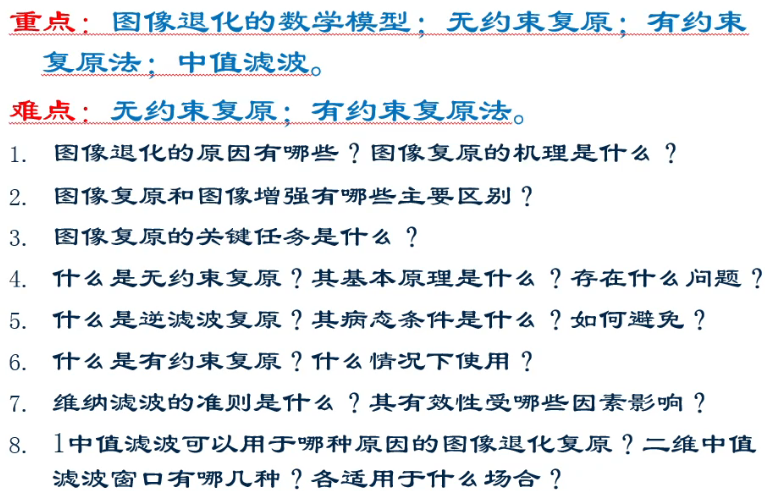

1. 图像退化的原因

   - 镜头聚焦不准产生模糊
   - 相机与景物之间相对运动产生模糊
   - 成像模糊
   - 射线、辐射、大气湍流等因素噪声几何畸变
   - 成像时导致变形
   - 底片感光
   - 随机噪声

   图像复原为图像退化的逆过程，通过估计找到退化的数学模型，并修复退化后的图像。典型的图像复原方法是根据图像退化的**先验知识**建立一个退化模型，

2. 图像增强主要是**改进图像的视觉效果，突出 ROI 区域，与原始图像有差异**。图像复原时对退化的图像进行复原，**重建原图像**。评价图像复原质量的好坏使用客观标准。

3. 关键任务是建立退化模型。

4. 无约束图像复原：不添加任何其他条件，只求 $||n||=||g-H\cdot\hat f||^2$ 的最小值。但是可能会存在逆矩阵不存在的情况却有近似解的问题。

5. 逆滤波复原：变换到频域进行滤波。

   **病态条件：**复原过程中，可能会出现 $H(u,v)$ 的值太小或者为 0 的情况，导致产生不稳定解。

   为了避免 $H(u, v)$ 值太小，在 $H(u, v)=0$ 的那些频谱点及其附近，人为地设置 $H^{-1}(u, v)$ 的值，使得在这些频谱点附近 $N(u, v)/H(u, v)$ 不会对$(u, v)$产生太大的影响。

6. 有约束图像复原：给图像复原基于图像的先验知识加上约束条件。当产生了传递函数的病态问题之后，复原只能在靠近原点的区域进行，可以使用有约束复原。

7. 维纳滤波将原始图像 $f$ 和对原始图像的估计 $\hat f$ 作为随机变量，按照使 $f$ 和 $\hat f$ 之间的**均方误差达到最小的准则**实现复原，维纳滤波器也称为最小均方滤波器：$e^2=E\{[f(x,y)-\hat f(x,y)]^2\}$，$E\{\cdot\}$ 表示数学期望。

   有效性影响因素：

   - 选用的准则（MSE）
   - 无法处理具有空间可变点扩散函数，散差、弯曲、旋转的运动模糊的情况。
   - 无法处理非平稳信号和噪声的一般情形。

8. 中值滤波可以去除噪声和保留边缘的复原效果。

   

### 第十章 - 图像分割与边缘检测

1. 看图

2. 图像分割是把图像分成若干个具有独特性特征的区域，并提取出感兴趣目标。主要方法又：

   - 基于阈值的分割方法
   - 基于区域的分割方法
   - 基于边缘的分割方法
   - 基于特定理论的分割方法

   图像分割的过程也是一个标记过程，即把属于同一区域的像索赋予相同的编号。

3. 灰度阈值分割：图像按灰度分成不同的等级，设置对应阈值，保留对应阈值的像素。

   确定阈值的方法：

   - 最佳阈值法

     使用概率估计目标物体和背景，求得错误估计的概率最小时对应的阈值。

     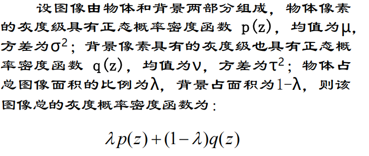

     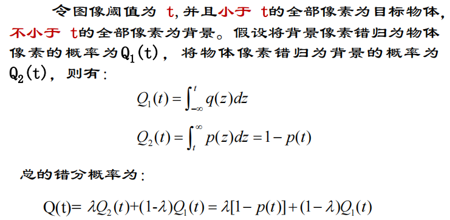

     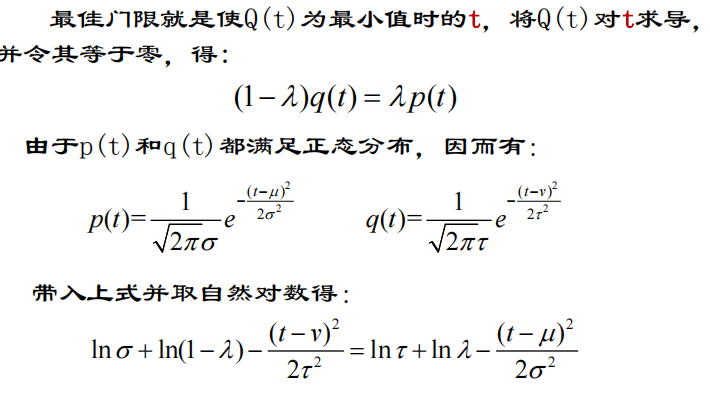

     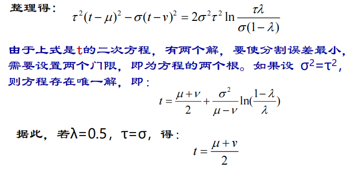

   - 判别分析法

     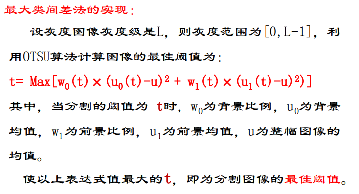

4. 区域分割：

   - 区域生长法

     从一个起点出发，向起点的 4 邻域开始生长，只有起点的像素值和平均灰度级的差小于某个数时才生长到对应的区域。

     

     

     

     

   - 分裂合并法

     

     先分割 4 个区域，然后按照灰度级分割不同的区域，相同灰度级的则不分裂或者和周围的合并。

     

5. 沿**边缘方向**的**灰度变化比较平缓**；而边缘**法线方向**的**灰度变化比较剧烈**。

   图像中像素灰度有阶跃变化或屋顶变化的那些像素的集合。

   边缘信号主要有：

   

6. 边缘检测算子：

   - Roberts：采用**对角线方向相邻两像素之差近似的梯度幅值**来检测边缘。该算子定位较准确，但对噪声比较敏感，检测水平和竖直边缘效果好于斜向边缘。

   - Sobel：根据图像的**像素**点**上下、左右邻点灰度加权差**在边缘处达到极值这一特点来检测边缘。该算子对噪声有较好的平滑作用，能提供建准确的边缘方向信息，但是边缘定位精度不高。
   - Laplacian：利用边缘点处二阶导函数出现零交叉原理来检测图像的边缘。对灰度突变及噪声较敏感，不具有方向性，不能获得图像边缘的方向信息。
   - Canny：去噪能力强，在连续性、细度和笔直度等线的质量方面也很出众。
   - Prewitt：与Sobel算子类似，也是在一个掩模中**定义微分**运算。算子对噪声具有平滑作用，同样定位精度不够高。

7. 二阶梯度算子：Laplacian 算子

8. 边缘检测前要对图像进行**平滑**处理。

9. 图像匹配：将两幅图像在空间上进行对准。

   模板匹配、直方图匹配、形状匹配

10. **模板匹配**是指用一个较小的图像即模板，与源图像进行比较， 以确定在源图像中是否存在与该模板相同或相似的区域，若该区域存在，还可确定其位置并提取该区域。

    局限：计算量大；只能进行平行移动，无法匹配旋转、大小发生变化后的图像；只能匹配可见部分。

11. 匹配原理：

    直方图匹配：直方图相交法、欧氏距离法、参考颜色法、中心矩法、$X^2$ 匹配。

    形状匹配：不变矩法、几何参数法、特征模表示法、边界方向直方图法、小波重要系数法、小波轮廓表示法

### 第十一章 - 图像特征与理解

1. 图像特征指图像的各种属性的特征，如几何特征、形状特征。

   几何特征是指图像中物体的位置、方向、周长和面积等方面的特征。

   形状特征是指矩形度、宽长比、圆形度、球状性、不变矩、偏心率

2. SIFT，Scale Invariant Feature Transform，尺度不变特征变换。

   - 图像的局部特征，对旋转、尺度缩放、亮度变化保持不变，对视角变化、仿射变换、噪声也保持一定程度的稳定性；
   - 独特性好，信息量丰富，适用于海量特征库进行快速、准确的匹配；
   - 多量性，即使是很少几个物体也可以产生大量的SIFT特征；
   - 高速性，经优化的SIFT匹配算法甚至可以达到实时性；
   - 扩展性，可以很方便的与其他的特征向量进行联合。

   实际应用价值：这类特征不会因为成像、光照、仿射变换、噪声等问题而影响特征。找到某类物体的关键点，无论这个物体发生什么变化都不会影响其特征。

3. 提取图像特征之前需要对图像进行**分割和二值化处理**，获得轮廓信息。

4. 计算区域的周长：

   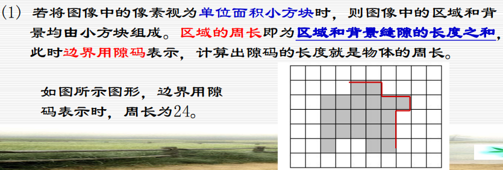

   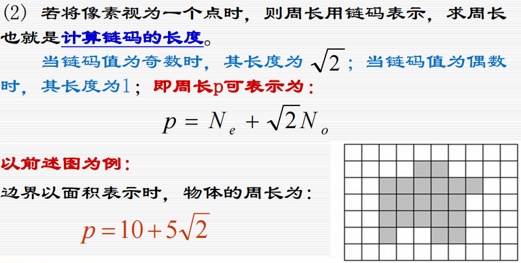

   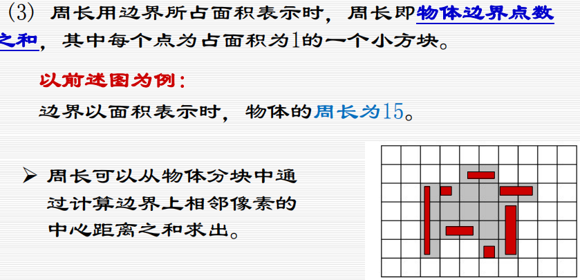

5. 计算区域面积：

   - 像素计数法：统计边界内部的像素的总数。

   - 边界行程码计算法：

     

   - 边界坐标计算法：

     

6. 形状特征是指矩形度、宽长比、圆形度、球状性、不变矩、偏心率

7. 不变矩

8. 图形的拓扑性质**具有稳定性**，即只要图形没有发生破坏性变形，则其拓扑性质不会因为物理变形而改变。

   欧拉数：$E=C-H$，其中 $H$ 为孔洞数，$C$ 为区域内连接的部分。

## 习题

### ppt 习题

判断低通高通：全正为低通，有正有负为高通。方向看哪一行或列被抑制（负数）

低通——平滑；高通——锐化。

 

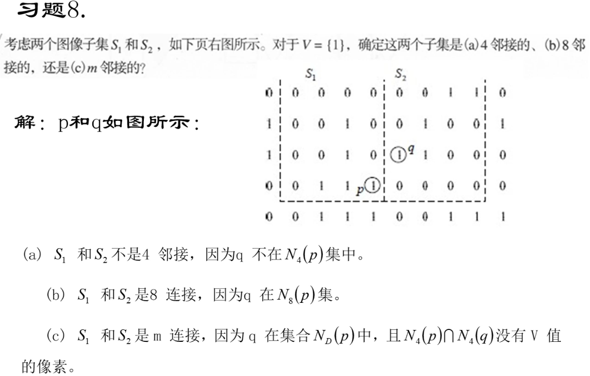

### 计算题

## 规定化

只要看两个累加，然后相互比较，对 R 的累加要从头开始看，如果是 0 就不管，只管不是 0 的映射，找到最接近的两个值，然后把对应的 pr 加起来就得到了pz

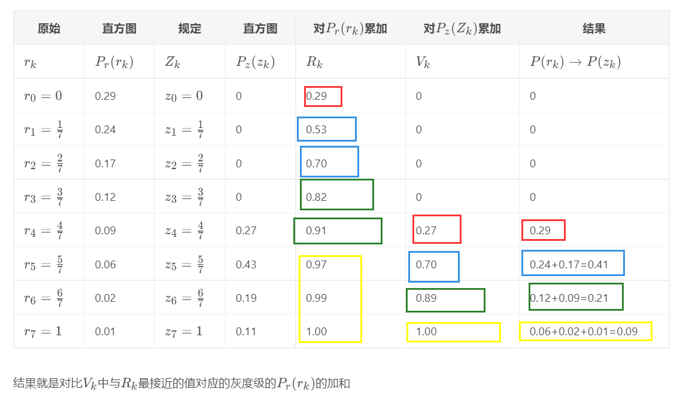

