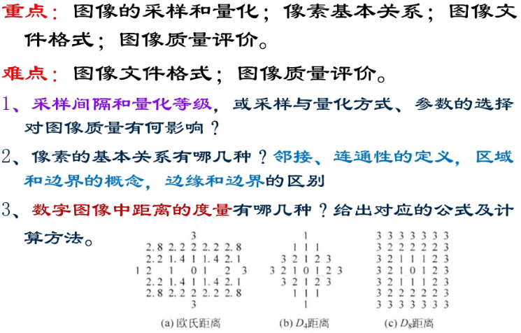
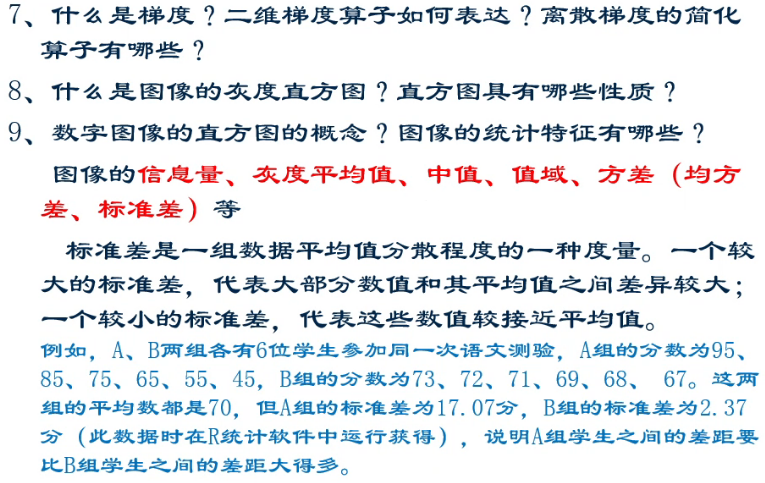
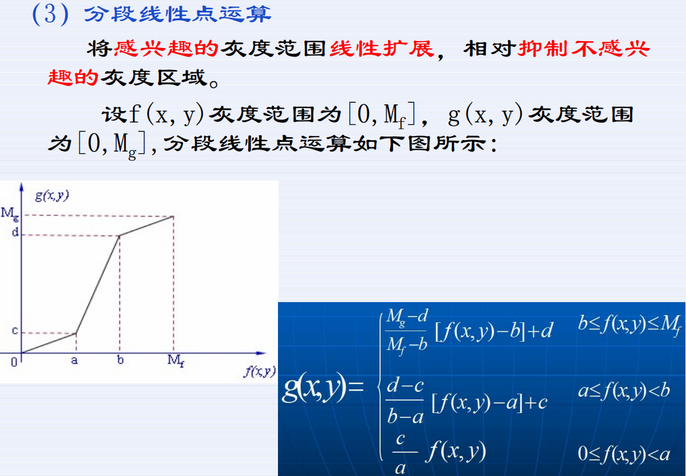
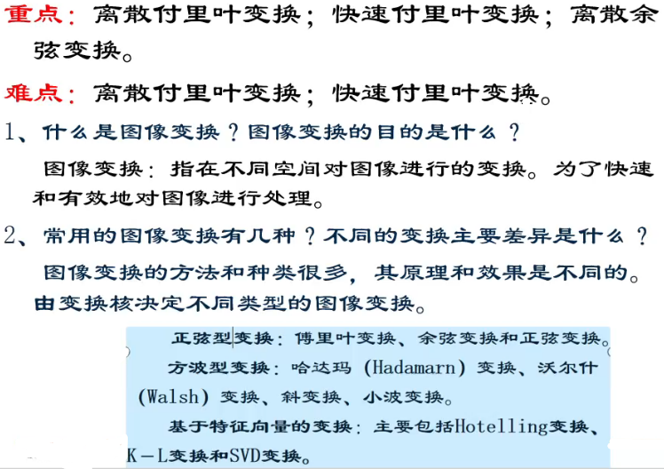
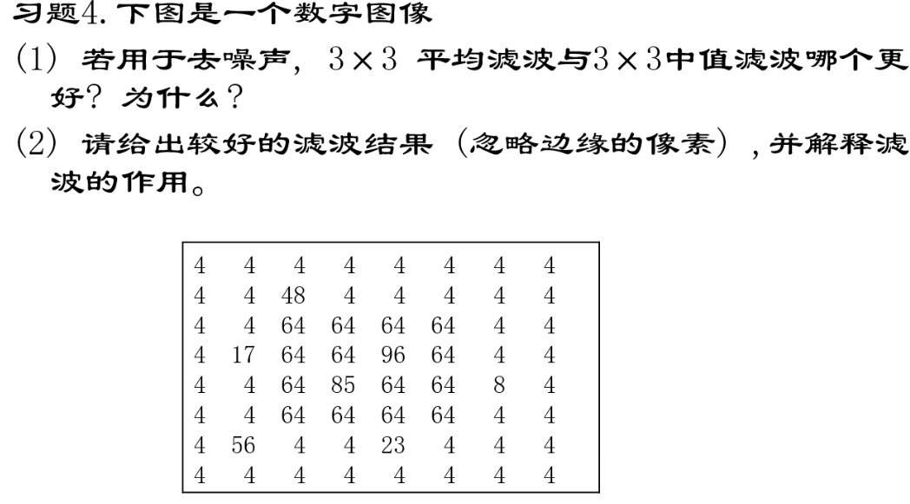
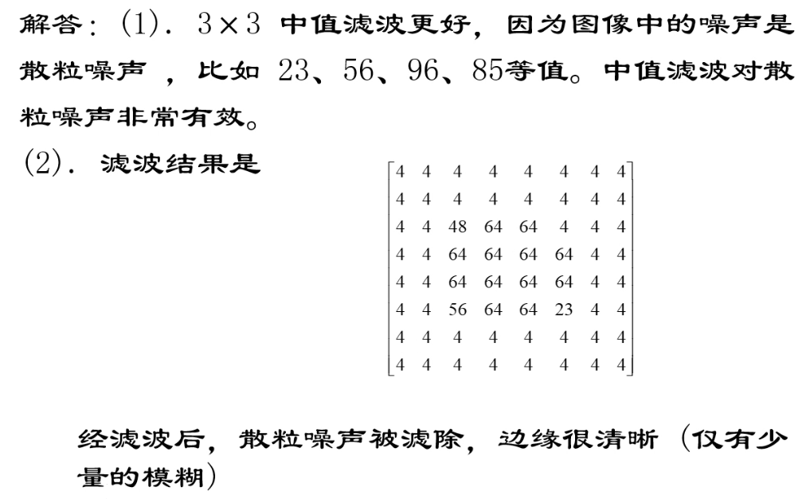
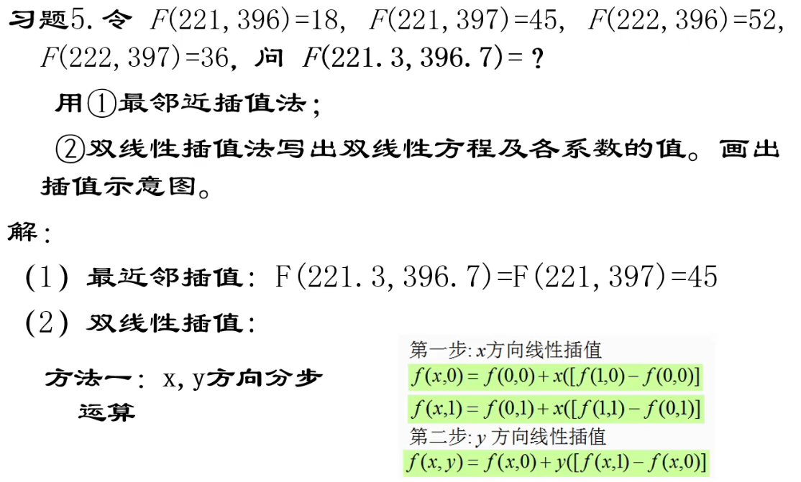
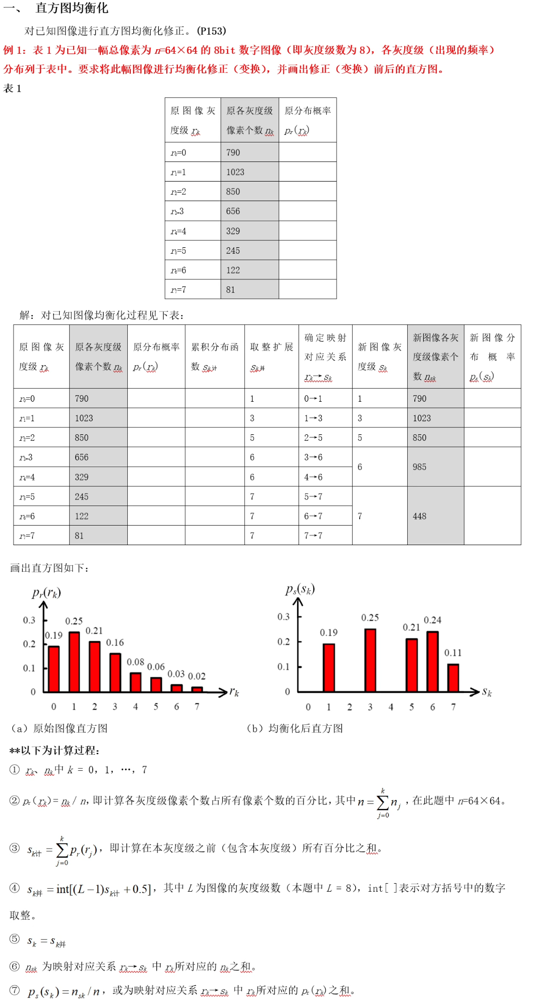

# 习题课

> 考试题型：问答题、分析题、计算题

## 考点

### 第一章 - 基础概念

- 彩色模型：

  - RGB：由红、绿、蓝三色组成
  - HSI：由色度（H）、饱和度（S）、亮度（I）组成
  - CMYK：由青色（C）、品红色（M）、黄色（Y）、黑色（B）组成
  - YUV：由亮度（Y）和两个色差信号（U，V）组成

- RGB 转 HSI 公式：

  

- 图像的存储

  存储图像一个像素占一个字节（`8 bits`），因为表示一个像素需要 8 bits，即 0 ~ 255 范围，故一幅图像有多少个像素（包括不同通道上的）就占用多少个字节。

### 第二章 - 图像数字化

:::tip

看图像的一个像素也要看周围的像素点。四周的或者周围一圈的像素点。

:::

1. 量化：将亮度信息离散化后，用多少位来表示一个像素点。**一般采用 8 bits 量化**。在 3 bits 以下的量化会使得图像出现**伪轮廓的现象**。

   灰度变化**平缓**的地方用较多的量化级，灰度变化**剧烈**的地方使用较高的分别率。

2. 邻域：指图像上的**某一个像素周围邻接的像素**。4-邻域指某一个像素的**上、下、左、右的四个像素**构成的区域。8-邻域指**上下左右相邻的四个像素加上左上、左下、右上、右下四个像素**构成的区域。

   

   邻接：描述两个像素 p 和 q 邻域是否相邻。**4-邻接指 p 像素在 q 像素的4邻域。8-邻接是指 p 像素在 q 像素的8-邻域。对角邻接是指 p 像素在 q 像素的对焦邻域。** m-邻接是指 p 像素在 q 像素的 4 邻域或对角邻域，但 p 和 q 的  4 邻域交集为空。

   连通性：p 和 q 两个像素按照邻接关系存在一条连通的路径，则说明是连通的。（不同的邻接方式组成的区域也不同）

   区域：连通的像素点组成的集合。

   边界：邻域不属于区域的像素点就是边界点，边界点组成的集合成为边界。

   边缘：灰度值产生差异较大的地方。

3. 距离描述方式：

   

   

4. 图片存储格式：

   - BMP：位图文件，包括BMP文件头、位图信息头、颜色表、位图数据

   - GIF：图形交换格式，基于LZW（字串表压缩法）算法的连续色调无损压缩格式。数据压缩比高，占用空间少。可存放若干幅静止图像形成连续的动画，拥有色彩表、支持文本覆盖。可错行存放。

   - JPEG：联合照片专家组，有损压缩去除冗余图像和色彩数据，具有极高的压缩率，采用不同的压缩比来调整图像质量进行压缩。文件大小较小。

     JPE2000：压缩率提高了 30%，支持有损压缩和无损压缩，支持 ROI 感兴趣区域，通过定制区域指定部分区域的压缩。

   - TIFF：标签图像文件格式，图象格式复杂，存储信息多，有利于原稿的复制。支持多种色彩位。可以描述多种类型的图像、拥有一系列压缩方案可选、不依赖于硬件、是一种可移植的文件格式。

   - PNG：可移植网络图形格式，使用 Zlib 无损压缩算法，压缩比高。

5. 技术模板

6. 图像质量评价

   - MSE：均方误差，比较两个图片逐像素之间的距离，再求其平均值。
     $$
     \text{MSE}=\frac{1}{MN}\sum\sum(f_{ij}-f'_{ij})^2
     $$
   
   - SNR：信噪比，参考图像素值的平方均值与均方误差的比值的对数值的10倍。
     $$
     \text{SNR}=10\lg\frac{\frac{1}{MN}\sum_{x,y}f^2(x,y)}{\frac{1}{MN}\sum_{x,y}v^2(x,y)}
     $$
   
   - PSNR：峰值信噪比，最大信号量与噪声强度的比值。**用图像的最大像素值代替最大信号量。**
     $$
     \text{PSNR}=10\lg\frac{255^2}{\frac{1}{MN}\sum_{x,y}v^2(x,y)}=10\lg\frac{255^2}{MSE}
     $$
   
   - SSIM：结构相似度，考虑图像的亮度相似度、对比度相似度、方差相似度的度量值的指标，衡量图像质量。
     $$
     \text{SSIM}(x,y)=[l(x,y)]^\alpha[c(x,y)]^\beta[s(x,y)]^\gamma \\
     l(x,y)=\frac{2\mu_x\mu_y+c_1}{\mu_x^2+\mu_y^2+c_1} \\
     c(x,y)=\frac{2\sigma_x\sigma_y+c_2}{\sigma_x^2+\sigma_y^2+c_2} \\
     s(x,y)=\frac{\sigma_{xy}+c_3}{\sigma_x\sigma_y+c_3}
     $$
   
     **SSIM 越大，说明图像质量越好，SSIM 越小，说明图像质量越差。**其中：
     $$
     \mu_x=\frac{1}{N}\sum_{i=1}^Nx_i,\ \sigma_x=\sqrt{\frac{1}{N-1}\sum_{i=1}^N(x_i-\mu_x)^2} \\
     \mu_x=\frac{1}{N}\sum_{i=1}^Ny_i,\ \sigma_y=\sqrt{\frac{1}{N-1}\sum_{i=1}^N(y_i-\mu_y)^2} \\
     \sigma_{xy}=\frac{1}{N-1}\sum_{i=1}^N(x_i-\mu_x)(y_i-\mu_y)
     $$
     分别表示为图像的**均值、标准差和协方差。**

### 第三章 - DIP 数学基础

1. 线性系统是指可以接受一个输入并且产生一个输出的实体，且这个系统是线性的。系统的定义为 $y_i(t)=f[u_i(t)]$

   如果满足 $y_1(t)+y_2(t)=f[a_1u_1(t)+a_2u_2(t)]=a_1f[u_1(t)]+a_2f[u_2(t)]$，则系统满足线性。

   移不变系统，当一个系统的平移了相同长度的 $T$，但是输入对应的输出也是一样的。输入任意时刻的事件，输出也延时同样的时刻 $T$，但幅值保持不变，表示为 $f[u(t-T)]=y(t-T)$。**也就是该系统产生的信息号和发生的时刻无关，只和对应的系统有关。**

2. 调谐信号：$x(t)=e^{j\omega t}=\cos(\omega t)+j\sin(\omega t)$

   系统响应为 $y(t)=K(\omega, t)x(t)$，复值函数 $K(\omega, t)$：$K(\omega,t)=\frac{y(t)}{e^{j\omega t}}$

   可以证明，线性移不变系统对于**调谐信号的响应等于输入信号乘以传递函数**。传递函数包含了所表示的**系统的所有特征。**

   线性移不变系统性质：

   - 调谐输入总产生**同频率**的调谐输出。
   - 系统的传递函数——一个依赖于频率的复值函数，包含了**系统的全部信息**。
   - 传递函数对调谐信号的输入会产生两种影响——**幅度变化和相位的平移**。

   **幅值表示系统对输入信号的放大或者衰减倍数，相位表示位移角，将输入信号以时间原点进行平移。**

3. 卷积运算的性质：满足交换律、结合律、分配律、求导。

   卷积运算在信号、图像处理学科上成为**滤波**。线性移不变系统的输出可以用**卷积**来描述，使用**输入信号和冲击响应函数的卷积**表示 $y(t)=u(t)*h(t)$，**冲击相应函数也描述了整个系统的特征**。（所以在卷积神经网络中，权重表示了图像的特征）

4. 图像相关性：$R_{fh}(t)=f(t)\circ h(t)=\int_{-\infin}^\infin f(\tau)h(t+\tau)d\tau$。经过化简之后可得本质上是一个信号反者之后的卷积，即 $R_{fh}(t)=f(t)\circ h(t)=f(-t)*h(t)$。

5. 二维线性系统：$g_i(x,y)=T[f_i(x,y)]$，满足$a_1g_1(x,y)+a_2g_2(x,y)=T[a_1f_1(x,y)+a_2f_2(x,y)]=a_1T[f_1(x,y)]+a_2T[f_2(x,y)]$，则是线性的系统。

   二维线性移不变系统（位置不变线性系统）：满足 $g(x-x_0,y-y_0)=T[f(x-x_0,y-y_0)]$

6. 矩阵运算：转置、求逆、共轭等

7. 梯度：二维图像两个方向的导数，故为向量。

   二维梯度算子，所有的算子都是以**差分**的形式表示。
   $$
   \begin{cases}
   \nabla_xf=f(m,n)-f(m-1,n) \\
   \nabla_yf=f(m,n)-f(m,n-1)
   \end{cases}
   $$
   幅值和方向为：
   $$
   \nabla f=\sqrt{(\nabla_xf)^2+(\nabla_yf)^2} \\
   \theta=\arctan(\nabla_yf/\nabla_xf)
   $$
   对于离散系统，可以简化为：
   $$
   \nabla f \approx |\nabla_xf| + |\nabla_yf| \\
   \nabla f \approx max(|\nabla_xf|, |\nabla_yf|)
   $$

8. 灰度直方图

   灰度直方图是对灰度图像中不同像素值的像素进行统计。

   直方图的性质

   - 直方图不包含位置信息
   - 图像与直方图之火箭是一种多对一的关系
   - 直方图可叠加

9. 统计特征：信息量、均值、方差、众数、中值、值域、协方差。

### 第四章 - DIP 数学运算

1. 运算：

   - 点运算：针对图像的像素值进行逐个运算。

     

     

     

   - 代数运算：两幅输入图像之间进行点对点的加减乘除运算。

   - 几何运算：对图像进行平移、旋转、放大、缩小等变换，以及变换中灰度内插处理。

2. 代数运算：两幅输入图像之间进行点对点的加减乘除运算。

   加：降噪效果、生成图像叠加效果

   减：消除背景、检测同一场景两幅图像之间的变化

   乘：图像的局部显示

   除：医学图像处理、遥感图像处理

3. 几何运算：对图像进行平移、旋转、放大、缩小等变换，以及变换中灰度内插处理。

   空间变换：齐次变换、平移变换、镜像变换、旋转变换、

   灰度插值：最近邻插值、双线性插值、三阶插值

4. 齐次坐标：使得图像能够用统一的线性变换实现几何变换，需要一种统一的坐标，将图像统一化表示后再进行操作。有了齐次坐标就能够方便做任何形式的变换。

5. 部分比几何变换的方法需要生成原本不存在的像素值，如比例缩放、旋转变换。所以需要使用**插值**的方式来补充图像上缺少的像素。插值方法根据其附近的像素使用算法计算出在某个位置的像素值。

   常见的三种内插方法：最近邻插值、双线性插值、三阶插值

6. 图像变换：通过数学映射的方式，将空域图像转换到频域、时域等方式进行分析。

   几何变换：改变图像的大小和形状。

### 第五章 - 图像变换

1. 

### 第六章 - 图像增强

（必考直方图均衡化、规定化）

### 第七章 - 图像复原

（问答题）

### 第十章 - 图像分割与边缘检测

### 第十一章 - 图像特征与理解

## 习题

### ppt 习题

 

### 计算题

## 规定化

只要看两个累加，然后相互比较，对 R 的累加要从头开始看，如果是 0 就不管，只管不是 0 的映射，找到最接近的两个值，然后把对应的 pr 加起来就得到了pz

